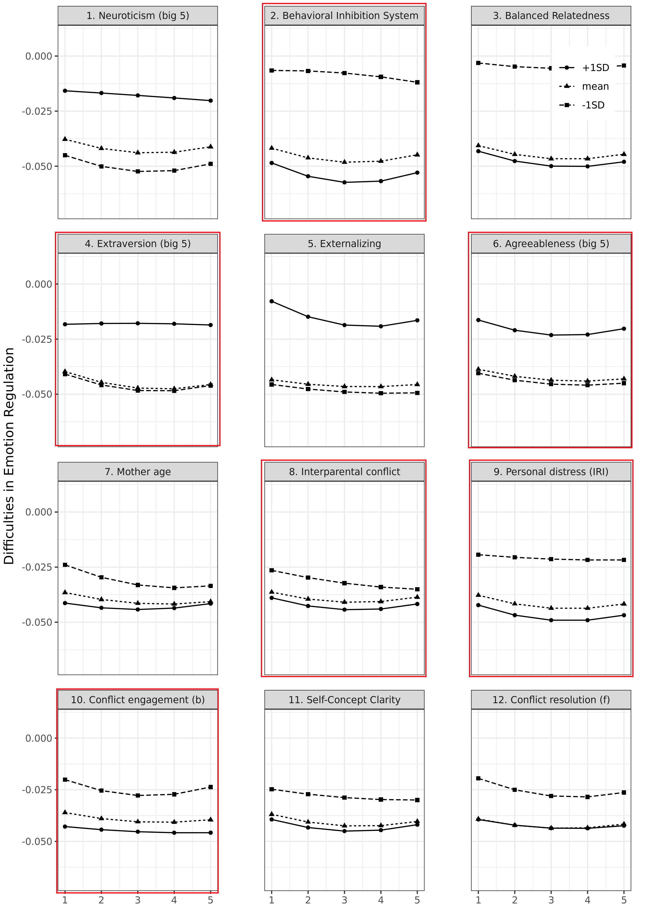
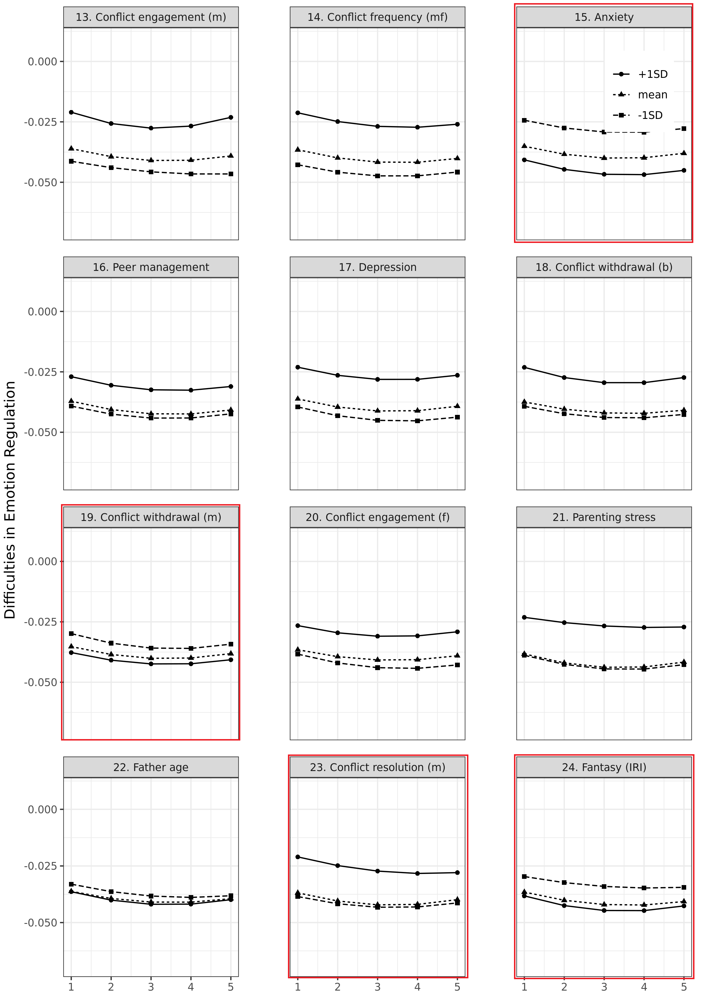
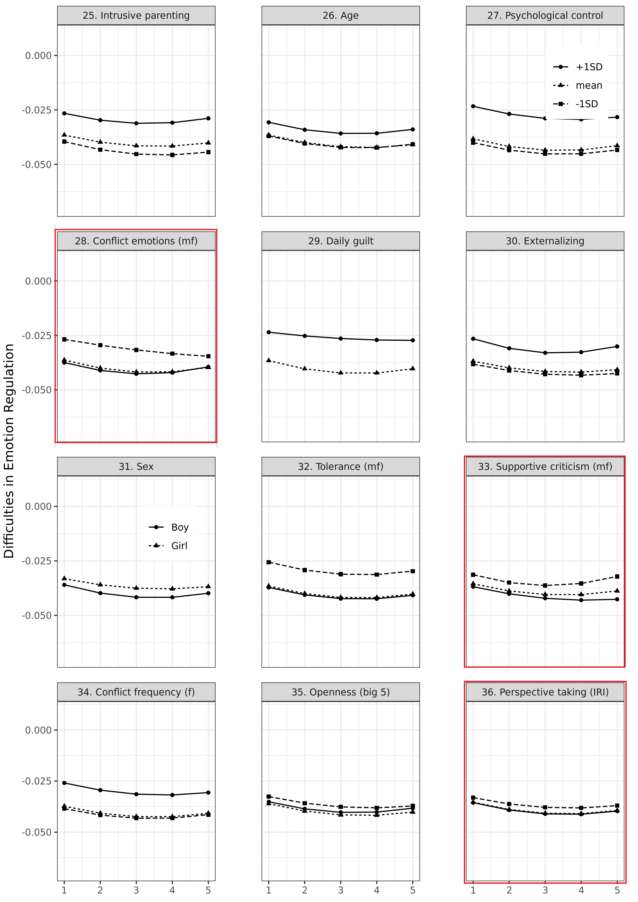
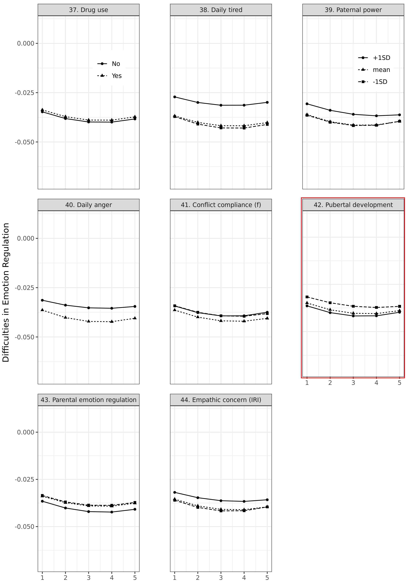
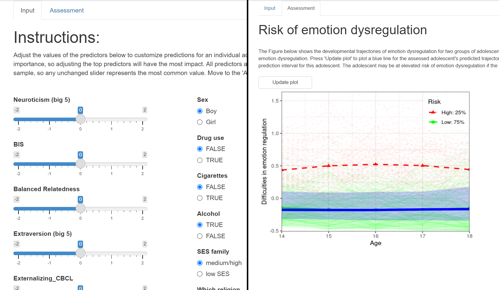

```{r setup, include = FALSE}
library("papaja")
library("worcs")
library(tidySEM)
# this does nothing for apa_table:
options(knitr.kable.NA = '')
# To make svg work, use this and 
# header-includes:
#   - \usepackage{svg}
#options(tinytex.engine_args = '--shell-escape')
```

<!-- https://www.srcd.org/news/child-development-special-section-formalizing-theories-child-development -->
<!-- TS: Emotion regulation development is a critical challenge in adolescence. -->
<!-- TS: Emotion dysregulation has severe consequences for individual adolescents, and society at large. -->
<!-- TS: Therefore, substantial research has addressed this topic. -->
<!-- TS: Most preceding research has been limited in scope, focusing on only a few theoretically-driven predictors. -->
<!-- TS: Machine learning makes it possible to cast a wider net, and explore all (available) potentially relevant predictors. -->
<!-- TS: Confirmatory versus exploratory research: Define the distinction. -->
<!-- TS: Some longitudinal research falls between these categories. For example, complex longitudinal studies, where prior research is sufficient to lead us to hypothesize *some* associations between two constructs, but not sufficiently specific to let us hypothesize which parameters will be significant. -->
<!-- TS: Instead, us -->

A key challenge in adolescence is developing mature emotion regulation abilities [@zimmermannEmotionRegulationEarly2014]. 
Adolescents experience biological, cognitive, and social changes that create an opportunity for positive emotion regulation development [@steinbergAgeOpportunityLessons2014].
Still, as many as 20% of adolescents instead experience severe emotion regulation difficulties [@leeAdolescentMentalHealth2014],
with potentially lifelong implications for mental health and well-being [@aldaoEmotionregulationStrategiesPsychopathology2010].
These difficulties in emotion regulation can cause substantial distress to the individual,
and incur a sizable societal cost.
A comprehensive understanding of the risk factors that predispose some adolescents to emotion dysregulation could aid in the development of effective screening and interventions.
However, despite an abundance of empirical research,
many studies are narrow in scope, considering only a few predictors,
the literature is fragmented across subdisciplines, and lacks a unifying theoretical framework
<!-- that is both specific to adolescence and comprehensive in scope  -->
[@vanlissaMappingPhenomenaRelevant2021].

The present study seeks to overcome these limitations
by using data-driven insights to complement and reflect on existing theory.
To this end, a broad range of potential risk factors were analyzed using machine learning,
and ranked in terms of predictive importance.
<!-- These predictors may include both risk factors that render some youth susceptible to emotion regulation difficulties, and correlates that can be used to identify at-risk youth. -->
Specifically,
the SEM-forests algorithm was used to
identify the most important early indicators of developmental trajectories
of emotion regulation across adolescence.
The resulting insights indicate which factors are most predictive of adolescents' diverging destinies in terms of emotion regulation development.
Armed with this knowledge, future research and interventions can focus on the most important predictors.
Moreover, these insights can guide the formation of overarching theory that adequately represents essential phenomena.
<!-- complement existing theory on adolescent emotion regulation using data-driven insights from machine learning. -->

## Emotion dysregulation in adolescence

Emotion regulation,
defined as the ability to manage emotional experience and expression,
is critical for mental health [@aldaoEmotionregulationStrategiesPsychopathology2010, @schaferEmotionRegulationStrategies2017, @braetEmotionRegulationChildren2014]
and social competence [@zimmermannEmotionRegulationEarly2014] throughout life.
There is mounting evidence, however, that adolescents do not uniformly become better at regulating emotions: 
staggered development of emotional and regulatory brain circuits gives rise to a "maturity gap" in mid-adolescence [@croneUnderstandingAdolescencePeriod2012].
The emotional salience of social stimuli is intensified, while the ability to regulate these emotions lags behind [@caseyBrakingAcceleratingAdolescent2011, @vanlissaLongitudinalInterplayAffective2014].
This imbalance motivates most adolescents to engage in adaptive exploration:
Seeking out experiences required to develop mature socio-emotional competences.
At the same time, this imbalance renders some adolescents vulnerable to emotion dysregulation [@leeAdolescentMentalHealth2014].
<!-- exposes youth to a risk of emotion dysregulation, -->
For example, they might not yet be sufficiently equipped to regulate the pursuit of unhealthy incentives,
or persevere in pursuing adaptive goals when facing obstacles.
Thus, some become trapped in a negative spiral characterized by more negative and volatile emotions [@craccoEmotionRegulationChildhood2017],
which has been linked to the emergence of several mental disorders [@schaferEmotionRegulationStrategies2017].
<!-- This imbalance motivates most youngsters to seek out new challenges in life and love, -->
<!-- but renders some of them vulnerable to emotion dysregulation1,10. Unfortunately, there is little theory about which risk factors and environmental hazards render adolescents susceptible to emotional difficulties11. -->
<!-- Acquiring adaptive emotion regulation skills in adolescence plays a key role in this regard7,20, because t -->
 
Empirical support for this notion of diverging destinies is evident from studies that examine developmental trajectories of emotion regulation in adolescence: 
Such studies consistently reveal large between-individual heterogeneity [see @craccoEmotionRegulationChildhood2017; @vanlissaRoleFathersMothers2019; @zimmermannEmotionRegulationEarly2014; @reindlSocializationEmotionRegulation2016].
An important next step is to identify which risk factors render some adolescents susceptible to emotion dysregulation.
<!-- This goal fits within the paradigm shift that has gripped the field of pedagogy, towards "person-centered" research, which focuses on individual developmental trajectories and within-family predictive processes, rather than average patterns across samples16,23. Seminal studies have applied "clustering" methods to identify youth with similar developmental trajectories14,24–26. Adolescents may follow similar trajectories for different reasons, however, and person-centered methods are too complex to accommodate more than a handful of theoretically-derived predictors. Unfortunately, relevant theory on adolescent emotion regulation development is limited27–29. The field is therefore at an impasse: We know that some adolescents are more susceptible to emotion dysregulation than others, but lack tools and theory to identify important predictors of individual development30. -->

## Potential predictors of emotion regulation development

Several theories are commonly cited in research on adolescent emotion regulation.
Notably, there appears to be a trade-off between these theories' scope and specificity.
Some theories are broad in scope, considering many potential risk factors, but are non-specific.
This limits their usefulness in generating testable predictions, and renders them impervious to falsification.
Other theories are narrow in scope, and are sufficiently specific to derive testable predictions, but lack broader context.
Two examples of macro-theories are the bioecological model [@bronfenbrennerBioecologicalModelHuman2007] and the transactional model [@sameroffUnifiedTheoryDevelopment2010].
The bioecological model describes how individual development is shaped by factors at different levels of analysis:
The individual level, which includes biological make-up and individual differences;
the microsystem, composed of primary caregivers and close relationships;
the mesosystem, including school and neighborhood factors;
the exosystem, including media, political- and economic influences;
and the macrosystem, consisting of cultural norms and values.
The transactional model is compatible with the bioecological model;
it describes development as an interplay between the individual child and the environment.
It distinguishes proximal environmental influences, roughly corresponding to the microsystem,
from more distal influences.
With increasing age, distal influences are thought to become more influential. 
More specific theories primarily focus on cognitive maturation and the role of primary caregivers,
including the theory of normative emotional development [@sroufeAttachmentDyadicRegulation1996]
and the tripartite model of emotion regulation socialization by parents [@morrisRoleFamilyContext2007] and peers [@reindlSocializationEmotionRegulation2016].
Note that the tripartite model is one of the few theories that explicitly addresses the life phase of adolescence.
It would be beneficial to work towards a more comprehensive theory of emotion regulation development,
specific to adolescence,
that is broad in scope and still specific enough to derive testable predictions.

<!-- * Bioecological model [@bronfenbrennerBioecologicalModelHuman2007] -->
<!-- * Transactional model [@sameroffUnifiedTheoryDevelopment2010] -->
<!-- * Hall's notion of "storm and stress" -->
<!-- * Theory of normative emotional development [@sroufeEmotionalDevelopmentOrganization1995] -->
<!-- * Tripartite model [@morrisRoleFamilyContext2007] -->
<!-- * Internalization model [@holodynskiDevelopmentEmotionsEmotion2006] -->
<!-- * Polyvagal theory [@porgesOrientingDefensiveWorld1995]. -->
<!-- * Model of social-affective engagement and goal flexibility [@croneUnderstandingAdolescencePeriod2012] -->
<!-- * Process model of emotion regulation [@grossHandbookEmotionRegulation2013] -->
<!-- * Social Information Processing Theory [@lemeriseIntegratedModelEmotion2000] -->

<!-- Maybe review theory briefly? -->
The first step towards theory formation or revision is identifying relevant phenomena [@borsboomTheoryConstructionMethodology2020].
<!--Thus, offering a starting point for this endeavor,<!-- empirical investigations of predictors of adolescents' emotion regulation development -->
A recent literature review did so
using a text mining systematic review of author keywords and abstracts of 6305 publications on  adolescents’ emotion regulation [@vanlissaMappingPhenomenaRelevant2021].
Typically, phenomena are identified using narrative literature reviews.
However, these are often limited to a small number of papers and structured around well-established ideas [@littellEvidencebasedBiasedQuality2008].
Text mining systematic reviews, by comparison, are relatively comprehensive and derive insights from the literature through a relatively transparent and objective - albeit less interpretative - procedure [@vanlissaMappingPhenomenaRelevant2021]. <!-- reflection and meaning-making-->

The results of that review indicated that internalizing and externalizing problems and mental health-related outcomes were most frequently studied in conjunction with emotion regulation. 
Some relevant phenomena reflected themes also identified in prior narrative reviews,
including cognitive development, parenting, and external stressors [cf. @coe-odessEmergentEmotionsAdolescence2019].
Other relevant phenomena were underrepresented in prior theory and reviews,
such as substance use, structural disadvantage,
identity, morality, sex and sexual development.
This relatively comprehensive overview offers a starting point for empirical investigations of predictors of adolescents' emotion regulation development, such as the present study.
<!-- To this end, the present study sought to identify operationalizations of these relevant phenomena in a large-scale panel study. -->

## Complementing theory using machine learning

According to models of knowledge production within the quantitative positivist paradigm,
a field progresses through the cyclical alternation of exploratory and confirmatory research, also known as the "empirical cycle" [@degrootMethodologieGrondslagenVan1961, @wagenmakersCreativityVerificationCyclePsychological2018].
Exploratory research gives rise to testable predictions,
and confirmatory research evaluates testable predictions on new data.
Crucially, these phases are linked through evaluation of existing theory in light of empirical findings [@degrootMethodologieGrondslagenVan1961].
The fact that our field still lacks overarching theory despite decades of productive empirical research
suggests that the empirical cycle is not routinely completed.
In support of this claim, it has been noted that the overwhelming majority of research in our field appears, at first glance, to be confirmatory [@demuthQualitativeMethodologyDevelopmental2015].
More exploratory research is thus needed to complete the cycle.
Secondly, and paradoxically given the first argument,
the link between confirmatory research and theory is often tenuous.
For instance, many studies derive their predictions from prior empirical research, not from theory [e.g., @vanlissaCostEmpathyParentadolescent2017].
Thirdly, theories are rarely falsified or revised in light of empirical findings.
This failure to evaluate theory leads to flexible, "invulnerable" frameworks that can accommodate any result [@szollosiArrestedTheoryDevelopment2021].
To advance theory formation, our field might benefit from "closing the empirical cycle" through increased exploratory research and reflection on theory.

There are preliminary indications of a move towards exploratory research:
Developmental scientists are turning to increasingly complex structural equation models.
Consider, for example, the burgeoning interest in disentangling between-family differences from within-family processes using the innovative random-intercept cross-lagged panel model [@hamakerCritiqueCrosslaggedPanel2015] and dynamic structural equation modeling [@asparouhovDynamicStructuralEquation2018].
Many authors using these methods have realized that existing theory is not sufficiently precise to derive distinct hypotheses at these two levels [see @nevilleBidirectionalAssociationsScreen2021; @vanlissaMothersFathersQuantitative2020].
By necessity, these models are thus used in at least a partly exploratory capacity.
This approach has two pitfalls.
Firstly, complex models are by definition more flexible and fit data better then simpler models, at the expense of decreased generalizability [@hastieElementsStatisticalLearning2009].
Flexibility is a hallmark of exploratory research [@wagenmakersCreativityVerificationCyclePsychological2018],
but increases the risk of false-positive results and questionable research practices in confirmatory research [@wichertsDegreesFreedomPlanning2016, @simmonsFalsePositivePsychologyUndisclosed2011].
It is therefore essential that flexibility is disclosed, and that exploratory and confirmatory research are clearly demarcated.
Secondly, structural equation models are inherently a confirmatory method,
and they can only include a limited number of predictors due to concerns of statistical power [@klinePrinciplesPracticeStructural2005].
Their use for exploration is limited, effortful, and potentially fraught (e.g., when using p-values for discovery instead of inference).
We argue that machine learning offers a suitable tool for rigorous exploration:
These methods discover patterns in data while maximizing generalizability,
and incorporate checks and balances to curtail false-positive results [@hastieElementsStatisticalLearning2009].
In the context of the present study, we use a specific machine learning algorithm uniquely suited for theory-guided exploration: SEM-forests [@brandmaierTheoryguidedExplorationStructural2016].

<!-- * Predictors of latent growth model? -->
<!--   + Only linear differences, few predictors (power) -->
<!-- * Multigroup latent growth model? -->
<!--   + Non-linear differences, but only one moderator -->
<!-- * Latent class growth model with auxilliary variables? -->
<!--   + Groups with regard to trajectory, not predictors -->

<!-- ## Solution: Machine learning -->

<!-- * Allows non-linear differences between trajectories -->
<!-- * Performs variable selection -->
<!--   + Cast wide net among potentially relevant predictors -->
<!-- * Checks & balances ensure generalizability -->
<!-- * Exploratory: No hypothesis -->


## The present study

The present study set out to identify the most important early indicators of developmental trajectories
of emotion regulation across adolescence.
This involves three important challenges:
First, the number of potentially relevant risk factors, as identified in a prior text mining systematic review, is large.
Second, there is a paucity of relevant theory to narrow down the candidate predictors.
Third, methods commonly used in the field are not well suited for large numbers of predictors.
Machine learning methods that perform variable selection can overcome these challenges.
We therefore used the SEM-forests algorithm to identify the most important early predictors of trajectories of emotion regulation development throughout adolescence.
The primary aim is to identify the most important predictors of adolescents' trajectories of emotion regulation development.
The secondary aim is to probe the nature of the marginal association of the predictors with these trajectories.

# Method

The Workflow for Open Reproducible Code in Science (WORCS) was used to make analyses reproducible [@vanlissaWORCSWorkflowOpen2020].
All analysis code, supplemental materials and synthetic data are available at <https://github.com/cjvanlissa/veni_forest>.
The original data (restricted) and all study documentation are available via <https://doi.org/10.17026/DANS-ZRB-V5WP>.

## Participants and procedure

```{r}
desc_num <- read.csv("../desc_num.csv", stringsAsFactors = FALSE)
desc_cat <- read.csv("../desc_cat.csv", stringsAsFactors = FALSE)
```
Participants were 497 Dutch adolescents and their parents enrolled in the longitudinal RADAR study  [@branjeResearchAdolescentDevelopment2018].
The RADAR sample was recruited from randomly selected elementary schools in the province of Utrecht, and four main cities in The Netherlands.
Of 1,544 randomly selected families, 497 produced informed consent and were included in the study.
From 2006 to 2012, trained interviewers conducted annual home visits to collect questionnaire data from adolescents and parents.
All independent variables were assessed in the first measurement wave.
The dependent variable was measured from the second to the sixth wave.
Adolescents received financial compensation for their participation in annual measurements (approximately \$17).

<!-- **Participants** -->

<!-- * RADAR data (https://www.uu.nl/en/research/radar) -->
<!-- * 497 Dutch adolescents (283 boys; age at T1: M =13.03, SD = 0.46) -->
<!-- * Collected between 2006-2011 -->
<!-- * Most families were  medium- to high-SES (10% low-SES) -->


## Measures

## Dependent variable

```{r}
ders_desc <- readRDS("../ders_desc.RData")
alphs <- sapply(ders_desc, function(x){x$alpha$total$raw_alpha})
```

From wave 2-6, adolescents completed the difficulty in emotion regulation scale [DERS, @gratzMultidimensionalAssessmentEmotion2004].
Based on prior psychometric analyses [see @vanlissaRoleFathersMothers2018],
we used 24 items of this 32-item scale
(e.g., "When I’m upset, I have difficulty thinking
about anything else").
Responses ranged
from 1 (Almost never) to 5 (Almost always).
Score reliability was excellent in all waves, $\alpha \in [`r report(min(alphs), equals = F)`, `r report(max(alphs), equals = F)`]$.
We used latent variable scores (instead of mean scores) for further analyses.
To this end, we imposed a five-factor CFA (one for each wave) on the indicators of the dependent variable.
Latent means were restricted to zero, such that resulting scores reflect the deviation of individual adolescents' trajectories from the overall trajectory.
As measurement invariance must be imposed in order to compare latent scores across waves,
we compared a model with configural invariance ($BIC = 141247.46$)
to a model that imposed metric invariance ($BIC = 140913.27$).
The lower BIC indicates support for metric invariance.
The RMSEA and SRMR of the invariant model indicated acceptable fit ($\text{RMSEA} = .05, \text{SRMR} = 0.05$), but the CFI indicated poor fit ($\text{CFI} = .80$).
As score reliability and standardized factor loadings were high across all waves ($\lambda \in [0.44, 0.84]$),
we considered it acceptable to proceed with individual factor scores for further analysis.

## Candidate predictors

We set out to identify operationalizations of all relevant phenomena identified in @vanlissaMappingPhenomenaRelevant2021 that were available in the RADAR data.
This yielded 87 candidate predictors, of which `r nrow(desc_cat)` categorical (see Table \@ref(tab:tabcat)), `r sum(is.na(desc_num$Items))` numerical, and `r sum(!is.na(desc_num$Items))` multi-item scales, see \@ref(tab:tabnum).
For multi-item scales, we used principal components analysis for dimension reduction.
Across all scales, the explained variance of the first component ranged from $R^2 \in [0.18, 0.90]$.
This first component represents the largest amount of shared variance among the scale items, and was used for further analysis.
[Supplementary Table S1](https://github.com/cjvanlissa/veni_forest/blob/master/supplemental_table_1.csv) additionally reports skew and kurtosis,
minimum and maximum factor loadings,
sample items,
and references to the validation paper for each scale.

```{r tabcat, results='asis'}
vimp <- readRDS("../variable_importance.RData")
ordr <- match(desc_cat$name, names(vimp))
desc_cat$name <- paste0(ordr, ". ", desc_cat$name)
desc_cat <- desc_cat[order(ordr, decreasing = FALSE), ]
names(desc_cat) <- c("Variable", "n", "%", "Category")
papaja::apa_table(desc_cat, caption = "Sample descriptive statistics for categorical predictors.", landscape = FALSE, longtable = TRUE, format.args = list(na_string = ""))
```
```{r tabnum, results='asis'}
ordr <- match(desc_num$name, names(vimp))
desc_num$name <- paste0(ordr, ". ", desc_num$name)
desc_num <- desc_num[order(ordr, decreasing = FALSE), ]
desc_num <- desc_num[,c("name", "n", "Items", "mean", "sd", "min", "max", "Reliability", "PC1")]
names(desc_num) <- c("Variable", "n", "i", "M", "SD", "min", "max", "alpha", "PC1")
papaja::apa_table(desc_num, caption = "Sample descriptive statistics for continuous variables and scales. n: valid sample size, i: number of items, M: mean, SD: standard deviation, alpha: Cronbach's alpha", landscape = FALSE, longtable = TRUE, format.args = list(na_string = ""))
```

## Missing data

The SEM-forests algorithm requires complete data and cannot accommodate multiple imputed data.
Consequently, we used single imputation using the missForest algorithm,
a random forests based approach with comparable performance to multiple imputation and FIML estimation [@stekhovenMissForestNonparametricMissing2012].
This method is valid when missingness is either random or contingent on observed data (MAR or MCAR).
It does not make any distributional assumptions and does not extrapolate,
meaning it returns realistic values within the range of the observed data.
The proportion of missingness ranged from $`r report(min((495-desc_cat[["n"]])/495), equals = F)` - `r report(max((495-desc_cat[["n"]])/495), equals = F)`$ for categorical data (see Table \@ref(tab:tabcat)),
and from $`r report(min((495-desc_num[["n"]])/495), equals = F)` - `r report(max((495-desc_cat[["n"]])/495), equals = F)`$ for continuous data (see Table \@ref(tab:tabnum)).
<!-- Original publication had up to 30% missing, Wolputte, E. V., & Blockeel, H. (2020, October). Missing value imputation with MERCS: a faster alternative to MissForest. In International Conference on Discovery Science (pp. 502-516). Springer, Cham. looked at higher numbers. According to Mplus: minimum 10% -->

## Strategy of analyses

Preliminary analyses were conducted to ensure the appropriateness of growth curve modeling, and determine the presence of heterogeneity in developmental trajectories.
First, trajectories of emotion regulation development were modeled using a curvilinear latent growth curve model with an intercept (I), linear slope (S), and quadratic slope (Q).
The full sample model fit was excellent, $\text{RMSEA} < .05, \text{SRMR} = 0.02, \text{CFI} = 1.00$.
Second, latent class growth analyses were conducted to determine the presence of youth with trajectories that indicated elevated risk of emotion regulation difficulties.
We used the R-package `tidySEM` [@tidysem] to estimate and compare 1-6 class solutions of the aforementioned curvilinear growth curve model;
analysis results are displayed in [Supplemental Table 2](https://github.com/cjvanlissa/veni_forest/blob/master/supplemental_table_2.csv).
To ensure model convergence in small classes, the latent variable covariance matrix was restricted to zero,
reflecting the assumption of homogeneity of trajectories,
with remaining heterogeneity attributed to error variance.
Class solutions with more than two classes were excluded from consideration due to low class separability (entropy < .9).
The LMR likelihood ratio test indicated that two classes significantly improved fit ($p < .001$); more classes did not ($p = .26$).
As displayed in Figure \@ref(fig:figclass),
about 25% of youth were at-risk for emotion dysregulation,
a similar proportion to what was found in previous studies [cf @leeAdolescentMentalHealth2014].

```{r figclass, fig.cap="Latent class analysis of risk profiles."}
knitr::include_graphics("../classplot.pdf")
```

As we set out to identifying important predictors of emotion regulation development,
this latent class analysis is not sufficient to answer our research question.
In latent class analysis, individuals are clustered only with respect the the outcome (growth trajectories), to ensure maximum homogeneity of growth trajectories in each class.
It thus answers the question: "Which adolescents have similar growth trajectories?"
SEM-forests similarly aim to ensure maximum homogeneity of growth trajectories within clusters,
but they differ from latent class analysis in that they cluster individuals by reference to a set of predictors.
They thus answer the question: "Why do some adolescents have similar growth trajectories?"
This method is suitable to meet the study goals.

For the SEM-forests analysis,
we imposed an additional restriction on the diagonal of the residual covariance matrix,
reflecting an assumption of homoscedastic residuals over time.
The SEM-forests algorithm operates as follows:

1. Bootstrap the data with replacement; we used 1000 bootstrap replications
2. For each bootstrap sample, construct a SEM tree:
    i. Estimate the latent growth model on the bootstrap sample
    ii. Consider a random selection of $K$ candidates out of all $p$ predictors; we used $k = 9$ based on the standard practice to use $K = \lfloor\sqrt{p}\rfloor$
    iii. Identify the predictor $k$ and value of that predictor that, when using that predictor and value to split the sample in two, maximizes the likelihood ratio $LR$ of a post-split multigroup model
    iv. Repeat steps 3 and 4 until all post-split groups reach a minimum size
3. Aggregate predictions from all SEM-trees

Each tree thus maps relationships between the predictors and outcome as a series of recursive splits of the data.
This approach intrinsically accommodates non-linear effects and (complex) interactions, which is an advantage over parametric models that assume linearity.
The algorithm additionally performs variable selection;
unimportant variables are not selected in step 2.iii.
Thus, the number of predictors can be large without risking model non-identification.

Our primary outcome of interest, variable importance,
is defined as the average absolute increase in model misfit due to randomization of each variable.
For each tree, the log-likelihood of cases not in that tree's bootstrap sample is computed twice:
Once using the true data for these cases, and once after randomizing one predictor.
The variable importance is given by averaging the ratio of these two log-likelihoods across all trees.
Our secondary outcome of interest, marginal associations,
were derived using a custom function developed for this paper.
For three values of each continuous predictor - namely the percentiles corresponding to the median, +/- 1SD of a standard normal distribution - 
model-implied growth trajectories were predicted for all other values of all other predictors.
To average across all other predictors, the median of these predicted growth trajectories was taken and plotted.

<!-- $$ -->
<!-- \begin{align} -->
<!-- \bm{\lambda} &=  -->
<!-- \begin{bmatrix} -->
<!-- 1 & 0 & 0^2 \\ -->
<!-- 1 & 1 & 1^2 \\ -->
<!-- \vdots & \vdots & \vdots \\ -->
<!-- 1 & 5 & 5^2 \\ -->

<!-- \end{bmatrix} -->
<!-- \\ -->
<!-- \bm{\psi} &= -->
<!-- \end{align} -->
<!-- $$ -->
<!-- Across all measurements, 13.3% of data were missing. -->
<!-- Little’s (1988) Missing Completely at Random (MCAR) -->
<!-- test produced a statistically significant value for the daily -->
<!-- identity and self-concept clarity variables, x -->
<!-- 2 -->
<!-- (8592) ¼ -->
<!-- 9228.07, p < .001, although the x -->
<!-- 2 -->
<!-- /df ratio was only 1.07. -->
<!-- Similarly, for the annual assessments, the MCAR test -->
<!-- produced a statistically significant value, x -->
<!-- 2 -->
<!-- (56) ¼ 75.19, -->
<!-- p < .001, although the x -->
<!-- 2 -->
<!-- /df ratio was only 1.34. These -->
<!-- findings suggest that data were likely missing at random, -->
<!-- and that maximum likelihood techniques were appropriate -->
<!-- for use. Moreover, even when the assumption of missing -->
<!-- completely at random is not met, the Full Information -->
<!-- Maximum Likelihood (FIML) procedure is still preferable to -->
<!-- listwise deletion of cases with missing data (McKnight, -->
<!-- McKnight, Sidani, & Figuredo, 2007). Listwise deletion -->
<!-- results in a biased sample, and therefore biased results, -->
<!-- by systematically excluding cases with missing data on -->
<!-- any of the study variables. We therefore utilized FIML -->
<!-- estimation using Mplus release 5.1 (Muthe´n & Muthe´n, -->
<!-- 2007). -->
<!-- Our analyses were based on an extension of cross-lagged panel modeling (Selig & Little, 2012), with staggered measurement occasions for one of the variables (mood variability). Mood variability was measured each time during the year between two measurement waves. Thus, for mood variability, no within-wave correlations were estimated, and all links with conflict frequency and difficulties in emotion regulation were specified as (predictive) regression paths. We used this staggered cross-lagged panel model to investigate over-time predictive effects between conflict frequency, day-to-day mood variability, and difficulties in emotion regulation. First, we estimated a single-group path model with autoregressive and cross-lagged paths, as well as within-time correlations for concurrent measurements (Model 1, see Table 1). Then we introduced empathy (high, average, low) as a moderator in a multi-group model, with all parameters free to vary between groups (Model 2). To derive the best fitting, most parsimonious model, we constrained parameters that were not significantly different. We used Wald \chi^2 tests to evaluate which parameters did not differ significantly, first over time and then between groups. We used the resulting final model to test our hypotheses (Model 3, see Figure 2). For hypotheses involving moderation, we used Wald tests to investigate whether parameters differed significantly between empathy groups. To test hypotheses involving mediation, we inspected indirect effects with bootstrapped standard errors (10,000 resamples). Furthermore, although posterior predictive probabilities were high, we conducted additional analyses, using the approach described by Asparouhov and Muthén (2014) to account for classification uncertainty. As can be seen in Appendix A, results were in line with the multi-group model reported here. -->
<!-- Attrition for the annual measurements ranged from 0.40% at age 13 to 14.50% at age 18, and attrition for the daily mood diaries ranged from 3.40% to 23.40%. These data were missing completely at random, Little’s (1988) MCAR test \chi^2(2179) = 2124.07, p = .80. Therefore, full information maximum likelihood estimation (FIML) was warranted to make use of all available information without estimating missing data. All analyses were conducted in Mplus Version 7 (Muthén & Muthén, 1998–2012). Per the developers’ recommendation, we used robust maximum-likelihood estimation, which yields a Satorra-Bentler scaled \chi^2 value to account for potential non-normality (Satorra, 2000). Model fit was evaluated using the Comparative Fit Index and Tucker–Lewis Index (CFI and TLI, acceptable fit = 0.90-0.95, Bentler & Bonett, 1980), and Root Mean Square Error of Approximation (RMSEA, close fit = 0.01-0.06, acceptable fit = 0.06-0.08, Browne & Cudeck, 1993). According to these criteria, the fit of the final model was acceptable-to-good (Table 1). In addition to these measures of objective fit, we also provide two comparative fit indices, the Akaike Information Criterion (AIC) and sample-size adjusted Bayesian Information Criterion (saBIC). Lower values on these comparative fit indices indicate a better fitting model. According to both relative and absolute fit indices, the final model had the best fit. -->

# Results

## Variable importance

Candidate predictors were rank-ordered by their relative variable importance,
as illustrated in Figure 1.
<!-- Table \@ref(tab:tablegend) provides a brief legend of the 30 most important variables, and  -->
Supplementary Table S1 provides a full legend of all variables.

```{r figvarimp, fig.cap="Predictors ranked in order of relative importance. m: mother, f: father, b: best friend, s: sibling."}
knitr::include_graphics("../pcomb.pdf")
```

```{r legtab, results="asis", eval = FALSE}
legtab <- read.csv("../legtab.csv", stringsAsFactors = FALSE)
papaja::apa_table(legtab, caption = "Brief description of 30 most important predictors.", format.arg = list(na_string = ""))
```

Examining the variable importance rankings,
several themes emerged.
Specifically, results indicated that several individual differences - personality and related constructs - were ranked among the most important predictors.
For example, three of the big five personality dimensions rank among the top six predictors: Neuroticism (1), extraversion (4), and agreeableness (6).
The Behavioral Inhibition Scale (BIS, 2), which reflects motivation to avoid aversive outcomes, ranked highly - although the BAS (73), its counterpart which measures motivation to approach goal-oriented outcomes,
ranked very low.
One dimension of empathy - personal distress (9), the tendency to experience aversive emotions in response to the misfortunes of others,
also ranked highly, and substantially higher than other dimensions of empathy.
Finally, self-concept clarity (11) also ranked highly; this construct represents the internal consistency of self-referential thought, and has close theoretical ties to identity [@schwartzDailyDynamicsPersonal2011].

A second emerging theme is that most constructs related to conflict frequency and behavior ranked highly, and few ranked low.
For instance, adolescent-perceived interparental conflict (8),
adolescents' conflict engagement (escalation) with best friends (10),
mothers (13) and fathers (20),
frequency (14) and negative emotionality (28) of adolescents' conflict with both parents,
and withdrawal from conflicts with best friends (18) and mothers (19).

A third emerging theme is that parenting was relatively underrepresented among the most important predictors;
the highest-ranking parental predictor was balanced relatedness (3),
a construct that represents the extent to which parents support and respect the adolescent's autonomy.
It further appeared that negative and intrusive aspects of parenting were more predictive than other positive practices:
Prohibition and control of friendship choice (16),
perceived intrusiveness and meddling (25),
psychological control (27),
and supportive criticism (33).
Positively valenced parenting dimensions like maternal (54) and paternal (55) support were ranked low,
and neutrally valenced aspects like parental monitoring (sollicitation 71, adolescent disclosure 72) were ranked very low.

It is further of note that some themes that are considered to be theoretically relevant ranked low.
For instance, indicators of maternal (86) and paternal (87) socio-economic status were ranked the lowest,
as were other family demographic indicators, like religion (81, 82). 
Aspects of adolescents' peer networks,
such as bullying (60, 84) and victimization (51, 62, 83),
and contact with delinquent peers (85) also ranked low.
The same applied to substance use;
the most commonly used substances of alcohol (78) and cigarettes (61) were ranked very low; drug use, which is less common, ranked a bit higher than this (37, but see direction of association).

## Direction of association

**Note that a number of predictors were reverse coded; re-computing the analyses that generate the Figures requires access to a supercomputer, which we have not been able to obtain at this point. These reverse-coded plots have been highlighted in red. Reverse the + and - 1SD lines to interpret these.**

Figures \@ref(fig:figpdp1)-\@ref(fig:figpdp4) depict the marginal association of the predictors with the outcome,
also in order of importance.
This provides an indication of whether the effect is generally positive, negative, or other.
Note that the dependent variable measures *difficulties* in emotion regulation;
thus, higher values represent poorer emotion regulation.

```{r figpdp1, fig.cap="Predicted trajectory of difficulties in emotion regulation for predictors 1-12. Red highlights indicate reverse-coded predictors."}

```
```{r figpdp2, fig.cap="Predicted trajectory of difficulties in emotion regulation for predictors 13-24. Red highlights indicate reverse-coded predictors."}

```
```{r figpdp3, fig.cap="Predicted trajectory of difficulties in emotion regulation for predictors 25-36. Red highlights indicate reverse-coded predictors."}

```
```{r figpdp4, fig.cap="Predicted trajectory of difficulties in emotion regulation for predictors 37-44. Red highlights indicate reverse-coded predictors."}

```

All associations were in a direction consistent with prior literature.
Among these were several factors associated with less difficulties in emotion regulation (i.e., potential protective factors), including
parents' autonomy support and tolerance,
big five extraversion and agreeableness, 
self-concept clarity,
problem solving in conflict with both parents,
parents' own emotion regulation ability,
and maternal age (older mothers had better adjusted children).

Other factors were associated with more difficulties in emotion regulation (i.e., potential risk factors or diagnostic aids),
including big five neuroticism, 
behavioral inhibition system,
externalizing and internalizing (depression and anxiety) problem behavior,
frequency and intensity of conflict with both parents,
and use of the conflict resolutions styles engagement and withdrawal.
Intrusive parenting behaviors were also negative predictors, including psychological control, control of friendships, paternal power, and constructive criticism.
All empathy dimensions except perspective taking predicted greater emotion dysregulation,
as did different daily negative emotions,
parental stress and interparental conflict,
age and pubertal development,
and sex (girls experienced greater difficulties in emotion regulation).

<!-- Categories:  -->

<!-- * Demographics (e.g., SES) -->
<!-- * Biological (age, sex, pubertal development) -->
<!-- * Individual differences (big5, BIS/BAS, empathy) -->
<!-- * Risk behavior (in/externalizing symptoms, substance use, delinquency, school performance, victimization) -->
<!-- * Relationship quality (parents/peers) -->
<!-- * Parenting (perceived and parent-reported) -->
<!-- * Conflict resolution styles -->


# Discussion

This study used the machine learning algorithm SEM-forests
to identify the most important early indicators of emotion regulation development across adolescence,
and to explore the nature of the association of those predictors with development. 
The results identified several potential protective- and risk factors.
Although all predictors attained a positive variable importance value,
there were differences in relative importance.
Individual differences in personality, motivation, self-concept clarity, and personal distress were among the most important predictors.
Conflict frequency and behavior also ranked highly.
Parenting ranked relatively low, with two notable exceptions:
First, balanced relatedness, a measure of autonomy support, was an important protective factor, and second,
among all remaining parenting constructs, negative and intrusive dimensions were more predictive (as risk factors) than positive or neutral parenting practices.
Themes that ranked notably low were family demographics (SES and religion),
bullying, victimization and delinquency, and substance use.

## Implications for theory

Relating these results to prior theory,
it is noteworthy that predictive importance of different themes appears to correspond to the levels of the bioecological model [@bronfenbrennerBioecologicalModelHuman2007]:
Predictors at the individual level were most important,
followed by those at the microsystem level, such as aspects of the relationship with parents,
followed by the mesosystem, including aspects of the peer network (e.g., bullying/victimization and delinquency), school performance, and socio-economic status,
and the macrosystem indicator religiosity was among the least important predictors.
Future theory might thus emphasize proximal factors over distal ones [see also @sameroffUnifiedTheoryDevelopment2010].

Another relevant insight for theory formation is that,
with the exception of autonomy support and negative parenting,
other parenting behaviors ranked low in predictive importance.
This might seem counter-intuitive in light of prior theory and empirical research.
As parents have a legal and moral imperative to care for their children,
much of developmental research has focused on parents' role.
One of the few highly specific theories of emotion regulation development focuses on the family context shapes adolescent emotion regulation development [@morrisRoleFamilyContext2007].
At the same time, however, this finding is consistent with an increasing number of recent studies - particularly those employing innovative methods to study processes within families - that have found little evidence for parent-directed processes in adolescence [@vanlissaRoleFathersMothers2019; @mastrotheodorosFamilyFunctioningAdolescent2020].
Of course, an alternative explanation might be that parenting effects take place earlier in development,
and are engrained in individual differences by the time youth reach adolescence.
However, a recent study tested this hypothesis in a younger sample and similarly found little evidence for parent-directed processes [@vanlissaMothersFathersQuantitative2020].
<!-- aren’t individual differences the result of the environment where those people were growing up, hence parental style as well? -->
We must thus consider the possibility that parents' influence, at least in adolescence, is less prominent than once was thought.
Future theories of adolescent emotion regulation development should thus at least go beyond parents' role.

Another finding that challenges contemporary discourse is that substance use and other "problem behaviors",
like time spent with delinquent peers, had very low variable importance ratings in predicting emotion dysregulation.
Even the highest ranked problem behavior, drug use, had no distinguishable marginal effect.
This suggests that drug use derives its high importance from higher-order interactions with other predictors.
It might be the case, for example, that for some youth, drug use contributes to self-exploration and social relationships, whereas for others, it may be a form of escapism, self-medication, or even self-harm.
This is merely a hypothesis, and further research is required to identify what interactions are at play.
These results imply that what are commonly thought of as risk factors might not be decisive in adolescents' emotion regulation development;
such factors ought to be included in future theory, but should not take center stage.

One emergent theme in the developmental literature is attention for fathers' role in child development [@vanlissaMappingPhenomenaRelevant2021].
Scholars have lamented the lack of attention to fathers,
and the equation of parenting with mothering [@keizerProspectiveStudyFather2014a].
With this in mind, it is worth noteworthy that the predictive importance of mothers' parenting did not outrank that of fathers' parenting in any way.
In fact, constructive conflict resolution with fathers was the highest-ranked construct related to conflict with parents;
paternal power was the highest-ranked parenting construct;
and maternal and paternal support and socio-economic status were both ranked approximately equally, despite both constructs being historically gendered.
This highlights the importance of considering both parents as equally relevant in future theory development.

A final consideration relevant for future theory development is to what extent 
research interest corresponds to the empirical importance of phenomena relevant for adolescents' emotion regulation.
A prior text mining systematic review comprehensively mapped the phenomena studied in this field [@vanlissaMappingPhenomenaRelevant2021].
It showed that among the most commonly studied phenomena were parenting, substance use, and bullying - all phenomena that ranked low in empirical importance in the present study.
Conversely, phenomena found to be important in the present study, such as personality and other individual differences, parental autonomy support, and conflict-related behavior were less prevalent in the literature.
Of course, the relative importance of predictors may vary across studies,
and replications of the present findings are required.
Nonetheless, this is an important reminder that the salience of a construct is not the same as its empirical importance.
As many theorists base their work on literature reviews and expert opinion,
focal topics in the literature are likely to garner undue theoretical weight.
Considering the empirical importance of phenomena may provide guidance in focusing future theory development in this area.

## Implications for practice

These findings have several implications for the early identification of youth at-risk for emotion regulation difficulties.
The fact that individual-level predictors were most important
suggests that individual assessments might be sufficient.
Holistic approaches that involve the family system might not be necessary for preliminary risk assessment.
Moreover, some of the most important predictors are already routinely assessed (for example, big five personality).
Other important predictors are overt, and thus easily observed by teachers and parents - for example, externalizing problem behavior and conflict frequency and behavior.
Future research might thus develop and validate risk assessment instruments
focusing on these constructs.

The method used in the present study is particularly well-suited to risk assessment instruments,
because machine learning models maximize predictive performance, whereas traditional methods like linear regression maximize performance within the study sample.
In fact, the trained model from the present study can be used to make predictions for the emotion regulation development of new adolescents.
To illustrate the potential for risk assessment, we developed ERRATA,
an Emotion Regulation Risk Assessment Tool for Adolescents (see Figure \@ref(fig:figerrata)).
Users can select values of categorical predictors,
and dial in low- to high values on a five point scale for each continuous predictor,
which are mapped to the percentiles of the observed data distribution corresponding to -2SD, -1SD, the median, +1SD, and +2SD of a standard normal distribution.
By default, all inputs are set to the median and mode values.
This means that users can use informative input for the most important predictors,
while keeping other less important predictors constant at the most common value.
The ERRATA application is open source, and can thus be customized for clinical use.

```{r figerrata, fig.cap="Screen captures of the ERRATA app."}

```

The present findings also have important implications for intervention.
However, it is important to consider the correlational nature of the study design.
Our findings reveal the strength of the association of each predictor with emotion regulation development.
Intervention can only be effective if this association can additionally be assumed to be causal, based on theory or experimental research.
Two phenomena appear to be prime candidates for intervention,
based on the variable importance rankings:
conflict resolution behavior, and (negative) parenting.

There is prior evidence for the efficacy of conflict resolution training in adolescents [@breunlinConflictResolutionTraining2002].
The same evidence indicates that conflict resolution training caused a decrease in externalizing problems (another important predictor), suggesting potential compounding benefits.
Parenting behavior is another promising target for intervention,
as indeed it has historically been.
Importantly, our results suggest that such interventions should focus on promoting parental autonomy support, and decreasing intrusive, negative, guilt-inducing and overbearing parenting behaviors.
By contrast, promoting positive parenting practices may have limited potential for impact.
With this in mind, it is important to consider that positive parenting practices are often a key focus of parenting training.
Although one meta-analysis did report large effects of the Triple P-Positive Parenting Program on parental outcomes - including some negative parenting behaviors [@fletcherImpactBehaviouralParent2011],
another meta-analysis called these findings into question,
citing mixed evidence, a lack of adequate blinding, risk of bias, and the substantial cost of such programs [@wilsonHowEvidencebasedEvidencebased2012].
<!-- Another study Even when negative parenting has been assessed as outcomes, -->
<!-- significant effects were found for positive practices only [@marcynyszynGettingEvidencebasedProgram2011]. -->
<!-- and that there have been prior concerns about the efficacy of such training [@wilsonHowEvidencebasedEvidencebased2012; @cottamDiscoursesUnderpinningParenting2014]. -->
Also note that the efficacy of parenting training has been evaluated primarily in terms of parents' self-reported outcomes;
the ultimate benefit for children,
in particular for adolescents' emotion regulation,
is less studied.
The relatively higher importance rankings for negative versus parenting is in line with the well-established *negativity bias*,
that negative stimuli are more psychologically impactful than positive ones,
which has also been found in children [@vaishNotAllEmotions2008].
Future parenting interventions might take this into consideration by devoting sufficient attention to the elimination of negative parenting practices,
and including children's outcomes, including emotion regulation, into consideration.
Simply put, the present results suggest that the best advice for parents might be to support their individuating adolescents' autonomy,
refrain from overly invasive or negative parenting practices,
and model problem solving behavior when conflicts arise.

## Methodological implications

Linear statistical models are the default in our field.
Therefore, an interesting result is that most predictors had non-linear effects:
Out of the three values contrasted in the marginal dependence plots,
only the one corresponding to the least desirable conditions diverged from the others.
<!-- For instanhigh neuroticism, high interparental conflict, low constructive conflict resolution with fathers. -->
Our findings send an important signal that many of the associations between predictors and developmental outcomes might be better modeled non-linearly.
In particular, they suggest a notion of "good-enough" preconditions for the development of mature emotion regulation.
Most adolescents seem to follow trajectories characterized by low difficulties in emotion regulation - except those with the most disadvantage.
Some prior research has considered this notion of a "good-enough" environment [@vanlissaCostEmpathyParentadolescent2017; @poonGoodEnoughParental2017];
the consistency of our findings suggests that it may be more ubiquitous than previously thought.

It is also noteworthy that some predictors had relatively high predictive importance,
but almost no marginal effect (e.g., father's age, drug use, openness to experience).
Such predictors likely derive their importance from interactions.
For instance, drug use might be a vehicle for social status or self-harm;
older fathers might be an asset if they are involved in children's lives but a liability if they prioritize professional success;
openness to experience may be an asset if it leads to self-discovery but a liability if it leads to risk behavior.
The present method is not well-suited to identify what interaction drives a variable's importance,
but these results might indicate potentially fruitful areas of future research. 

## Strengths and limitations

The present study had some unique strengths, most notably that it constituted the first comprehensive study of potential predictors of adolescent emotion regulation development. In contrast, prior work has taken more piecewise approaches, considering only a few predictors at a time.
This allows us, for the first time, to assess the relative importance of different (themes of) predictors, where the more fragmented approach used in prior work does not allow for such comparisons.
Another important contribution of the present study is that, in contrast to many other approaches,
our method accommodates non-linear associations and interactions.
Results indeed showed consistent evidence for non-linear effects,
and some indications for interactions. 
The present study answers recent calls for more person-centered research that explores heterogeneity in developmental processes.
Crucially, whereas other approaches have merely *explored* heterogeneity in outcomes (e.g., using latent class analyses),
the present study *explained* heterogeneity using a comprehensive battery of predictors.
This answers the question why some adolescents experience more difficulties in emotion regulation than others.
Another contribution is that the results have clear implications for theory, assessment, and intervention.
<!-- The present study set out to identify the most important early indicators of developmental trajectories -->
<!-- of emotion regulation across adolescence. -->
<!-- This involves three important challenges: -->
<!-- First, the number of potentially relevant risk factors, as identified in a prior text mining systematic review, is large. -->
<!-- Second, there is a paucity of relevant theory to narrow down the candidate predictors. -->
<!-- Third, methods commonly used in the field are not well suited for large numbers of predictors. -->
<!-- Machine learning methods that perform variable selection can overcome these challenges. -->
<!-- We therefore used the SEM-forests algorithm to identify the most important early predictors of trajectories of emotion regulation development throughout adolescence. -->
<!-- The primary aim is to identify the most important predictors of adolescents' trajectories of emotion regulation development. -->
<!-- The secondary aim is to probe the nature of the marginal association of the predictors with these trajectories. -->

The study also has limitations, most notably that the sample was selective,
which may limit the generalizability of the findings.
Specifically, this was a non-random, ethnically and socially relatively homogeneous sample from the Netherlands.
This raises specific concerns, for example, that the low importance of SES might be due to a restriction of range.
The sample might also be somewhat dated - especially considering daily life has changed drastically for youth coming of age in a post-pandemic world.
The only way to address these concerns is to replicate these findings in other samples.
Note that all code is made available in a reproducible archive to enable easy replication.
Another limitation is that the data source was a panel study with mostly questionnaire measures and relatively few biological, cognitive and neurological assays.
One final limitation related to the data is the relatively small sample size.
Machine learning methods benefit from large samples.
Although random forests are relatively robust to overfitting,
larger samples will likely yield more generalizable results,
and also afford more complicated models (thus removing the need for assumptions such as homogeneity of residuals).
Other limitations pertain to the method; for instance, SEM-forests require vast computational resources.
Computational constraints thus prevented us from tuning the model beyond default settings,
and from exploring marginal effects for higher order interactions.
Moreover, at the time of writing, there is not yet a method to evaluate the overall fit of a SEM-forest.

## Conclusions

Empirical research on adolescent emotion regulation development has been fragmented,
and lacks an overarching theoretical framework. 
The present study took a holistic approach to identify the most important predictors of emotion regulation development using machine learning.
Candidate predictors were selected based on a prior systematic review of 6305 relevant papers.
The SEM-forest algorithm was applied to rank-order these predictors by their relative importance for explaining heterogeneity in adolescents' developmental trajectories,
and to probe the nature of their association with emotion regulation development. 
Results indicated that the importance of different predictors corresponded somewhat with the levels of the bioecological model:
Proximal factors were more predictive of emotion regulation development than distal predictors; individual differences were most predictive, and mesosystem factors (e.g., SES, religion) were least predictive.
The results also suggested that parenting may be less relevant for emotion regulation development than previously thought, and that negative parenting may be more impactful than positive parenting.
The results have clear implications for early risk assessment:
Regularly administered personality inventories, and readily observable indicators like externalizing problems and conflict behavior were among the most important predictors, and these are suitable indicators for diagnostic tools.
The results further suggest that conflict skills training might be a promising avenue for adolescent-directed interventions.
Parenting interventions might benefit more from addressing the notion of "good enough" parenting and remedying negative and invasive behaviors than from promoting positive parenting behaviors.
The results also provide clear guidance for the ongoing effort of theory generation in this field:
Such theory should focus on proximal processes over distal ones.
Parents' roles might be less central than previously thought;
their support of adolescents' autonomy and the way they navigate conflict might be more important than their parenting behaviors.
Moreover, there was no evidence of differences between mothers' and fathers' parenting, indicating that both parents should be equally represented in future theory.
Finally, common perceptions about risk factors should be reassessed: 
delinquency, substance use, and bullying were all relatively less important predictors.
Even drug use, the highest-ranking problem behavior, had no distinguishable marginal effect, suggesting that it is more problematic for some adolescents than others.
These results illustrate how machine learning can provide a holistic view of a research area,
complement existing knowledge,
offer alternative perspectives,
and guide future research, practice, and theory formation.

\newpage

# References
```{r create_r-references}
r_refs(file = "r-references.bib")
```

\begingroup
\setlength{\parindent}{-0.5in}
\setlength{\leftskip}{0.5in}

<div id="refs" custom-style="Bibliography"></div>
\endgroup
