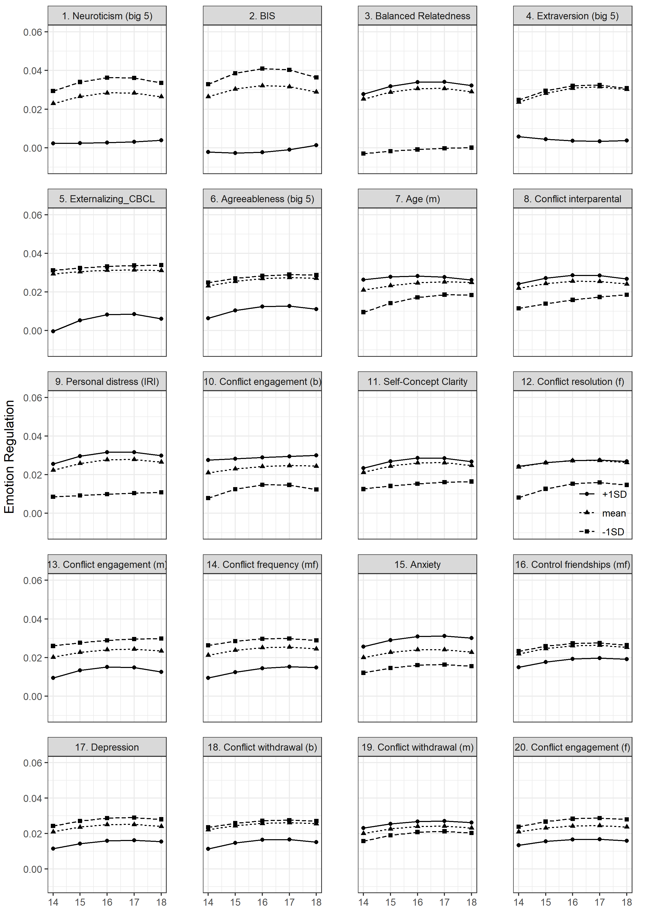

```{r setup, include = FALSE}
mask = TRUE
library("papaja")
library("worcs")
library(tidySEM)
# this does nothing for apa_table:
options(knitr.kable.NA = '')
# To make svg work, use this and 
# header-includes:
#   - \usepackage{svg}
#options(tinytex.engine_args = '--shell-escape')
```

<!-- https://www.srcd.org/news/child-development-special-section-formalizing-theories-child-development -->
<!-- TS: Emotion regulation development is a critical challenge in adolescence. -->
<!-- TS: Emotion dysregulation has severe consequences for individual adolescents, and society at large. -->
<!-- TS: Therefore, substantial research has addressed this topic. -->
<!-- TS: Most preceding research has been limited in scope, focusing on only a few theoretically-driven predictors. -->
<!-- TS: Machine learning makes it possible to cast a wider net, and explore all (available) potentially relevant predictors. -->
<!-- TS: Confirmatory versus exploratory research: Define the distinction. -->
<!-- TS: Some longitudinal research falls between these categories. For example, complex longitudinal studies, where prior research is sufficient to lead us to hypothesize *some* associations between two constructs, but not sufficiently specific to let us hypothesize which parameters will be significant. -->
<!-- TS: Instead, us -->

A key challenge in adolescence is developing mature emotion regulation abilities [@zimmermannEmotionRegulationEarly2014].
Adolescents experience biological, cognitive, and social changes that create an opportunity for positive emotion regulation development [@steinbergAgeOpportunityLessons2014].
Still, [as many as 20% of adolescents instead experience severe emotion regulation difficulties [@leeAdolescentMentalHealth2014],
with potentially lifelong implications for mental health and well-being [@aldaoEmotionregulationStrategiesPsychopathology2010].
These difficulties in emotion regulation can cause substantial distress to the individual,
and incur a sizable societal cost via their implications for mental health [@leeAdolescentMentalHealth2014].]{#cost}
A comprehensive understanding of the risk factors that predispose some adolescents to emotion dysregulation could aid in the development of effective screening and interventions.
<span id = "abundantlit">There is already an abundance of empirical research on adolescent emotion regulation and its predictors; a recent systematic review identified 6305 relevant publications [@vanlissaMappingPhenomenaRelevant2021].
An important limitation of the existing literature is that many studies narrowly focus on a few predictors within a specific research area,
and thus fail to provide insight into these predictors' relative importance compared to other predictors, including those in other domains.
Relatedly,
the literature lacks a unifying theoretical framework that is both specific to adolescence and comprehensive in scope [see @bariolaChildAdolescentEmotion2011].</span>

This exploratory study seeks to overcome these limitations by casting a broad net among potential risk factors, 
and using the resulting data-driven insights to complement and reflect on existing theory.
Machine learning was used to determine the relative utility of a wide range of potential risk factors.
Specifically,
<span id = "personcentered1">the SEM-forests algorithm [@brandmaierTheoryguidedExplorationStructural2016], a person-centered analysis technique, was used
to identify the most important early indicators (at age 13) of developmental trajectories
of emotion regulation across adolescence (age 14 through 18).
The results indicate which factors are most predictive of adolescents' diverging trajectories of emotion regulation development, contributing to our understanding of why some youth flourish while others struggle [@croneUnderstandingAdolescencePeriod2012].</span>
These insights can guide development of interventions that focus on the most important predictors,
and direct the formation of overarching theory that adequately represents essential phenomena.

## Emotion dysregulation in adolescence

Emotion regulation,
defined as the ability to manage emotional experience and expression,
is critical for mental health [@aldaoEmotionregulationStrategiesPsychopathology2010; @schaferEmotionRegulationStrategies2017; @braetEmotionRegulationChildren2014]
and social competence [@zimmermannEmotionRegulationEarly2014] throughout life.
There is mounting evidence, however, that adolescents do not uniformly become better at regulating emotions: 
staggered development of emotional and regulatory brain circuits gives rise to a "maturity gap" in mid-adolescence [@croneUnderstandingAdolescencePeriod2012].
The emotional salience of social stimuli is intensified, while the development of cognitive capacities lags behind [see @caseyBrakingAcceleratingAdolescent2011; @vanlissaLongitudinalInterplayAffective2014].
This imbalance might help motivate adolescents to engage in adaptive exploration:
Seeking out experiences that challenge their socio-emotional competences and stimulate growth.
At the same time, this imbalance may render some adolescents vulnerable to emotion dysregulation if they are not yet able to regulate the pursuit of unhealthy incentives,
or persevere in pursuing adaptive goals when facing obstacles [@leeAdolescentMentalHealth2014].
Thus, some become trapped in a negative spiral characterized by more negative and volatile emotions [@craccoEmotionRegulationChildhood2017],
which has been linked to the emergence of several mental disorders [@schaferEmotionRegulationStrategies2017].
 
Longitudinal studies of emotion regulation development in adolescence provide preliminary empirical support for this notion of diverging trajectories: 
Such studies consistently reveal large between-individual heterogeneity [see @craccoEmotionRegulationChildhood2017; @vanlissaRoleFathersMothers2019; @zimmermannEmotionRegulationEarly2014; @reindlSocializationEmotionRegulation2016].
<!-- Although some studies have examined, on average, how strongly particular risk factors are associated with developmental trajectories - most have done  REF write something about other studies examining risk factors -->
[An important target of research is thus to identify which risk factors render some adolescents susceptible to emotion dysregulation.]{#nextstep}
<!-- This goal fits within the paradigm shift that has gripped the field of pedagogy, towards "person-centered" research, which focuses on individual developmental trajectories and within-family predictive processes, rather than average patterns across samples16,23. Seminal studies have applied "clustering" methods to identify youth with similar developmental trajectories14,24–26. Adolescents may follow similar trajectories for different reasons, however, and person-centered methods are too complex to accommodate more than a handful of theoretically-derived predictors. Unfortunately, relevant theory on adolescent emotion regulation development is limited27–29. The field is therefore at an impasse: We know that some adolescents are more susceptible to emotion dysregulation than others, but lack tools and theory to identify important predictors of individual development30. -->

## Potential predictors of emotion regulation development

[Substantial prior research has examined potential risk factors.
However, a recent review of 6305 relevant publications noted that this literature is somewhat fragmented,
with most studies considering only a handful of variables within the scope of a particular sub-discipline [@vanlissaMappingPhenomenaRelevant2021].
If each study examines only a piece of the puzzle, it is hard to see the big picture.]{#fragmented}
This fragmentation may be due, in part,
to the fact that few theories are tailored to emotion regulation in adolescence,
and none consistently guide research in the field [@bussTheoriesEmotionalDevelopment2019].
Commonly cited theories in this field vary in scope and specificity [see @vanlissaMappingPhenomenaRelevant2021]:
Some are broad in scope, considering many potential risk factors,
but are somewhat non-specific.
This limits their usefulness in generating testable hypotheses,
and renders them impervious to falsification or improvement.
Other theories are narrower in scope, and are sufficiently specific to derive testable predictions, but lack broader context.
Two of the most influential broad theories are the bioecological model [@bronfenbrennerBioecologicalModelHuman2007; e.g., see @augustEmotionRegulationAtRisk2017] and the transactional model [@sameroffUnifiedTheoryDevelopment2010].
The bioecological model describes how individual development is shaped by factors at different levels of analysis:
The individual level, which includes biological make-up and individual differences;
the microsystem, composed of primary caregivers and close relationships;
the mesosystem, including school and neighborhood factors;
the exosystem, including media, political- and economic influences;
and the macrosystem, consisting of cultural norms and values.
<span id = "velez1">Note that a recent perspective on the bioecological model emphasizes that cultural practices are enacted by individuals at different levels of the model, including parents [@velez-agostoBronfenbrennerBioecologicalTheory2017].
This perspective is consistent with the transactional model,
which describes development as an interplay between the individual child and the environment.</span>
It distinguishes proximal environmental influences, roughly corresponding to the microsystem,
from more distal influences.
With increasing age, distal influences are thought to become more influential. 

More specific theories tend to focus on cognitive maturation and the role of primary caregivers.
Examples include the theory of normative emotional development [@sroufeAttachmentDyadicRegulation1996]
and the tripartite model of emotion regulation socialization in families [@morrisRoleFamilyContext2007], which has also been applied to the peer context [@reindlSocializationEmotionRegulation2016].
The tripartite model is one of the few theories that explicitly addresses the life phase of adolescence.
It posits that children's emotion regulation is shaped by modeling, specific parenting practices, and the emotional family climate (including the interparental relationship).
This model is relatively narrow, focusing on parents' role - but also sufficiently specific to derive testable hypotheses.
Note that few theories are both comprehensive and specific.
An important challenge for the field is thus to work towards an integrating theory of emotion regulation development in adolescence.

The first step towards theory formation is identifying relevant phenomena [@borsboomTheoryConstructionMethodology2020].
Phenomena considered relevant in a field of research are often summarized using literature reviews.
A recent review of 6305 publications on adolescents’ emotion regulation used text mining to identify relevant phenomena, including potential risk factors [@vanlissaMappingPhenomenaRelevant2021].
Narrative reviews are often limited to a small number of papers and structured around well-established ideas [@littellEvidencebasedBiasedQuality2008].
Text mining systematic reviews are more comprehensive and derive insights from the literature through a transparent and somewhat objective - albeit less interpretative - procedure [@vanlissaMappingPhenomenaRelevant2021].
The present study used this prior text mining review by Van Lissa as a starting point for an empirical investigation of the relative importance and direction of effect of these predictors.
It provides a relatively comprehensive overview of potential predictors of emotion regulation development.

According to this prior review,
the phenomena that have received most research attention are internalizing and externalizing problems, and mental health.
Although reciprocal effects cannot be excluded, these phenomena are typically conceptualized as outcomes of emotion dysregulation.
Note, however, that this does not diminish their usefulness as predictors.
Other important phenomena reflected what has been discussed in prior narrative reviews,
including cognitive development, parenting, and external stressors [cf. @coe-odessEmergentEmotionsAdolescence2019].
Finally, the method identified some phenomena that have received less attention in prior theory and reviews,
such as substance use, structural disadvantage,
identity, morality, sex and sexual development.
Prior theory and empirical research thus suggests many phenomena potentially related to heterogeneity in adolescents' emotion regulation development.

The aforementioned potential risk factors have largely been studied in isolation.
What is still missing is an understanding of the relative utility of different early indicators in predicting adolescents' developmental outcomes.
This knowledge gap cannot be addressed by comparing the relative importance of different predictors across studies,
as different studies tend to sample from different populations,
use different research designs,
different control variables and statistical models.
<!-- Furthermore, conventional methods are ill-suited to address this research question: -->
In part, this knowledge gap is a consequence of the limitations of conventional methods:
linear models limit the total number of predictors that can be included due to power concerns, risk of overfitting, and multicolinearity [@hastieElementsStatisticalLearning2009].
By contrast, some machine learning methods offer a more holistic approach,
as they can incorporate many candidate predictors and perform variable selection,
while incorporating checks and balances to ensure generalizable results [@hastieElementsStatisticalLearning2009].
The present study used a specific machine learning algorithm uniquely suited for theory-guided exploration: SEM-forests [@brandmaierTheoryguidedExplorationStructural2016].

## Introduction to SEM-forests

<span id = "semforests">The SEM-forests algorithm is based on the random forests algorithm, which in turn is based on regression trees [for an accessible introduction, see @stroblIntroductionRecursivePartitioning2009].
A single regression tree splits the sample repeatedly in two by whichever predictor makes both post-split groups maximally internally homogenous, and maximally different from one another.
A random forest consists of many regression trees grown on bootstrapped samples from the original dataset.
To ensure that each tree learns something different from the data, it may only consider a random subsample of $m$ candidates out of all $p$ predictors at each split.
With this in mind, the SEM-forest algorithm operates as follows:

1. Bootstrap the data with replacement; we used 1000 bootstrap replications
2. For each bootstrap sample, construct a SEM tree:
    i. Estimate the latent growth model on the bootstrap sample
    ii. Consider a random selection of $m$ candidates out of all $p$ predictors; commonly $m = \lfloor\sqrt{p}\rfloor$
    iii. [Identify the predictor $p_k$ and value of that predictor $x$ that, when using individual values on that predictor $p_{ki}$ to split the sample in two by the rule $p_{ki} \leq x$, maximizes the difference in model parameters between the two post-split groups (as determined by a likelihood ratio test).]{#stepiii}
    iv. [Build a SEM-tree by repeating steps 3 and 4 until all post-split groups reach a minimum size that is too small for further splitting. The tree is then considered fully grown.]{#fullygrown}
3. [Given an individual's scores on all predictor variables $p_i$, we can now traverse each tree in the forest to obtain a predicted value of the model parameters (in this case, the latent growth parameters). Aggregating the predicted parameters across all SEM-trees in the forest averages out prediction error.]{#predictions}

Each tree thus maps relationships between the predictors and outcome as a series of recursive splits of the data.
This approach intrinsically accommodates non-linear effects and (complex) interactions, which is an advantage over parametric models that assume linearity.
[As a simple example, imagine that only very low levels of autonomy support would be associated with elevated levels of emotion regulation (i.e., a higher intercept).
In regression analysis, this could be represented with a linear and quadratic term, and a plot might show that the effect of autonomy support on the intercept increases to a value $x_{knee}$, and then tapers off.
A tree-based model would represent the same effect by splitting the sample on autonomy support at the value $x_{knee}$.]{#nonlinearexample}
Note that SEM-forests intrinsically perform variable selection: unimportant variables are not selected in step 2.iii.
Thus, the number of predictors can be large without risking model non-identification.</span>

<!-- * Predictors of latent growth model? -->
<!--   + Only linear differences, few predictors (power) -->
<!-- * Multigroup latent growth model? -->
<!--   + Non-linear differences, but only one moderator -->
<!-- * Latent class growth model with auxilliary variables? -->
<!--   + Groups with regard to trajectory, not predictors -->

<!-- ## Solution: Machine learning -->

<!-- * Allows non-linear differences between trajectories -->
<!-- * Performs variable selection -->
<!--   + Cast wide net among potentially relevant predictors -->
<!-- * Checks & balances ensure generalizability -->
<!-- * Exploratory: No hypothesis -->


## The present study

The present study set out to obtain a comprehensive understanding of the relative utility of predictors of emotion regulation development across adolescence.
The primary aim was to identify the most important predictors of adolescents' developmental trajectories of emotion regulation development.
The secondary aim was to probe the nature of the relationship of each predictor with these trajectories.
An important challenge of these research aims is that the number of potentially relevant risk factors is too large for conventional methods.
At the same time, there is a paucity of relevant theory to narrow down the candidate predictors a priori.
We sought to overcome this challenge by using SEM-forests, 
a machine learning algorithm methods that performs variable selection,
to identify the most important early predictors of trajectories of emotion regulation development throughout adolescence.

# Method

`r ifelse(mask, "The Workflow for Open Reproducible Code in Science (WORCS)", "**Masked**")` was used to create a reproducible research archive  `r ifelse(mask, "[@vanlissaWORCSWorkflowOpen2020]", "**(masked reference)**")`.
All analysis code, supplemental materials and synthetic data are available at `r ifelse(mask, "<https://github.com/cjvanlissa/veni_forest>", "**masked URL**")`.
The original data and all study documentation are available under controlled access via `r ifelse(mask, "<https://doi.org/10.17026/DANS-ZRB-V5WP>", "**masked URL**")`.

## Participants and procedure

```{r}
desc_num <- read.csv("../desc_num.csv", stringsAsFactors = FALSE)
desc_cat <- read.csv("../desc_cat.csv", stringsAsFactors = FALSE)
```

<span id = "dutch">Participants were 497 Dutch adolescents and their parents enrolled in the ongoing longitudinal RADAR study  [@branjeResearchAdolescentDevelopment2018], which 
received ethical approval from the ethical committee of the University Medical Centre Utrecht.
The RADAR sample was recruited from over 200 randomly selected elementary schools in the province of Utrecht, and four main cities in The Netherlands.</span>
Of 1,544 eligible families, 497 produced informed consent and were included in the study.
[From 2006 to 2011, trained interviewers completed six annual measurement waves by collecting questionnaire data during home visits.]{#waves}
All independent variables were assessed in the first measurement wave.
[Sample demographic characteristics are reported in Tables \@ref(tab:tabcat) and \@ref(tab:tabnum).]{#demographics}
The dependent variable was measured from the second to the sixth wave.
Families received €100 financial compensation for their participation in annual measurements.

## Measures

### Dependent variable

```{r}
ders_desc <- readRDS("../ders_desc.RData")
alphs <- sapply(ders_desc, function(x){x$alpha$total$raw_alpha})
```

From wave 2-6, adolescents completed the Difficulties in Emotion Regulation Scale, which was reverse coded to represent emotion regulation [DERS, @gratzMultidimensionalAssessmentEmotion2004].
Based on prior psychometric analyses [see @vanlissaRoleFathersMothers2019],
we used 24 items of this 32-item scale
(e.g., "When I’m upset, I have difficulty thinking
about anything else").
Responses ranged
from 1 (Almost never) to 5 (Almost always).
Score reliability was excellent in all waves, $\alpha \in [`r report(min(alphs), equals = F)`, `r report(max(alphs), equals = F)`]$.
We used latent variable scores (instead of mean scores) for further analyses.
[To this end, we estimated a CFA with all DERS items loading on one latent variable per measurement wave.]{#singlefactor}
Latent means were restricted to zero, such that resulting scores reflect the deviation of individual adolescents' trajectories from the sample average trajectory.
As measurement invariance must be imposed in order to compare latent scores across waves,
we compared a model with configural invariance ($BIC = 141247.46$)
to a model that imposed metric invariance ($BIC = 140913.27$).
The lower BIC indicates support for metric invariance.
The RMSEA and SRMR of the metric invariance model indicated acceptable fit ($\text{RMSEA} = .047$,  $\text{SRMR} = 0.05$), but the CFI indicated poor fit ($\text{CFI} = .80$).
[Note that the RMSEA has been found to be more appropriate for longitudinal data, possibly because the null-model on which the CFI is based is less appropriate for repeated measures [@leiteDetectingGrowthShape2011]]{#cfi}.
As score reliability and standardized factor loadings were high across all waves ($\lambda \in [0.44, 0.84]$),
we proceeded with individual factor scores for further analysis.

### Candidate predictors

We set out to identify operationalizations of all relevant phenomena identified in @vanlissaMappingPhenomenaRelevant2021 that were available in the RADAR data.
This yielded 87 candidate predictors, including `r nrow(desc_cat)` categorical (see Table \@ref(tab:tabcat)), `r sum(is.na(desc_num$Items))` numerical, and `r sum(!is.na(desc_num$Items))` multi-item scales, see Table \@ref(tab:tabnum).
We used principal components analysis to obtain a single score for multi-item scales without making additional assumptions about the underlying measurement model.
For each scale, we retained the first component for further analysis, which represents the largest amount of shared variance among the scale items.
For example, consider the construct *neuroticism*, which was measured on a seven point Likert scale.
Participants were asked to indicate "Please indicate to what extent you posess these traits" for six adjectives associated with neuroticism.
Principal components analysis indicated that the first component was the only component with an Eigenvalue greater than one (3.22, other Eigenvalues [0.99 - .33].
This component explained the majority of variance in all six adjectives, $R^2 = .54$, or 3.24 times as much variance as could be expected if each dimension of the scale explained equal variance. Other components' $R^2 \in [.16 - .05]$.
All adjectives loaded highly on this first component, $L = [.54 - .83]$.
We thus used this first component as operationalization of the construct neuroticism.
Across all other scales, explained variance of the first component ranged from $R^2 \in [0.18, 0.90]$, which corresponded to 1.60 - 17.46 times as much variance as could be expected if scale dimension explained equal variance.
We thus considered these principal components to be adequate operationalizations of the scales.
[Supplemental Table S1](https://github.com/cjvanlissa/veni_forest/blob/2c545ab2195fade5d2be3e4a269c24e57e8921a8/supplemental_table_1.csv) additionally reports skew and kurtosis,
minimum and maximum factor loadings,
sample items,
and references to the validation paper for each scale.

```{r tabcat, results='asis'}
vimp <- readRDS("../variable_importance.RData")
ordr <- match(desc_cat$name, names(vimp))
desc_cat$name <- paste0(ordr, ". ", desc_cat$name)
desc_cat <- desc_cat[order(ordr, decreasing = FALSE), ]
names(desc_cat) <- c("Variable", "n", "%", "Category")
desc_cat$Category[desc_cat$Category == "TRUE"] <- "Yes"
desc_cat$Category[desc_cat$Category == "FALSE"] <- "No"
papaja::apa_table(desc_cat, caption = "Sample descriptive statistics for categorical predictors, ranked by variable importance.", landscape = FALSE, longtable = TRUE, format.args = list(na_string = ""))
```

```{r tabnum, results='asis'}
ordr <- match(desc_num$name, names(vimp))
desc_num$name <- paste0(ordr, ". ", desc_num$name)
desc_num <- desc_num[order(ordr, decreasing = FALSE), ]
desc_num <- desc_num[,c("name", "n", "Items", "mean", "sd", "min", "max", "Reliability", "PC1")]
names(desc_num) <- c("Variable", "n", "i", "M", "SD", "min", "max", "alpha", "PC1")
papaja::apa_table(desc_num, caption = "Sample descriptive statistics for continuous variables and scales, ranked by variable importance. n: valid sample size, i: number of items, M: mean, SD: standard deviation, alpha: Cronbach's alpha, PC1: variance explained by first principal component", landscape = FALSE, longtable = TRUE, format.args = list(na_string = ""))
```

## Missing data

The SEM-forests algorithm requires complete data and cannot accommodate multiple imputed data.
Consequently, we used single imputation using the missForest algorithm,
a random forests based approach with comparable performance to multiple imputation and FIML estimation [@stekhovenMissForestNonparametricMissing2012].
This method is valid, regardless of whether missingness is random or contingent on observed data (MCAR or MAR).
It does not make any distributional assumptions and does not extrapolate,
meaning it returns realistic values within the range of the observed data.
The proportion of missingness ranged from $`r report(min((495-desc_cat[["n"]])/495), equals = F)` - `r report(max((495-desc_cat[["n"]])/495), equals = F)`$ for categorical data (see Table \@ref(tab:tabcat)),
and from $`r report(min((495-desc_num[["n"]])/495), equals = F)` - `r report(max((495-desc_cat[["n"]])/495), equals = F)`$ for continuous data (see Table \@ref(tab:tabnum)).
[We compared participants with missing- versus complete data on demographic characteristics (sex, age, socio-economic status, religion and religiosity) and scores of emotion regulation in all waves, and found no significant differences, $p = [0.06, 0.48]$.]{#missing}
<!-- Original publication had up to 30% missing, Wolputte, E. V., & Blockeel, H. (2020, October). Missing value imputation with MERCS: a faster alternative to MissForest. In International Conference on Discovery Science (pp. 502-516). Springer, Cham. looked at higher numbers. According to Mplus: minimum 10% -->

## Strategy of analyses

All analyses were conducted in R [@R-base]. 
Preliminary analyses were used to establish the appropriateness of growth curve modeling, and determine the presence of heterogeneity in developmental trajectories.
First, trajectories of emotion regulation development were modeled using a curvilinear latent growth curve model with an intercept (I), linear slope (S), and quadratic slope (Q).
The full sample model fit was excellent, $\text{RMSEA} < .05, \text{SRMR} = 0.02, \text{CFI} = 1.00$.
Second, latent class growth analyses were conducted to determine the presence of youth with trajectories that indicated difficulties in emotion regulation (e.g. lower levels or a temporary dip).
We used the R-package `tidySEM` [@tidysem] to estimate and compare 1-6 class solutions of the aforementioned curvilinear growth curve model;
analysis results are displayed in [Supplemental Table S2](https://github.com/cjvanlissa/veni_forest/blob/2c545ab2195fade5d2be3e4a269c24e57e8921a8/supplemental_table_2.csv).
To ensure model convergence in small classes, the latent variable covariance matrix was restricted to zero,
reflecting the assumption of homogeneity of trajectories,
with remaining heterogeneity attributed to error variance.
The LMR likelihood ratio test indicated that two classes significantly improved fit ($p < .001$); more classes did not ($p = .26$).
[Furthermore, results indicated that solutions with more than two classes had low class separability (entropy < .9),
which means that these solutions are less interpretable [@jungIntroductionLatentClass2008].]{#entropy}
As displayed in Figure \@ref(fig:figclass),
about 25% of youth were at-risk for emotion dysregulation,
a similar proportion to what was found in previous studies [cf @leeAdolescentMentalHealth2014].

```{r figclass, fig.cap="Latent class analysis of risk profiles."}
knitr::include_graphics("../classplot.png")
```

As our research question was to identifying important predictors of emotion regulation development,
this latent class analysis does not yet provide an adequate answer.
Latent class analysis clusters individuals only with respect to the outcome (growth trajectories), and ensures maximum homogeneity of growth trajectories in each class.
It thus answers the question: "Which adolescents have similar growth trajectories"?
A SEM-forest similarly aims for maximum homogeneity of growth trajectories within clusters,
but unlike latent class analysis, clusters individuals by reference to a set of *predictors*.
It thus answers the question: "Why do some adolescents have similar growth trajectories"?
This matches the present study goals.

The main analysis consisted of a SEM-forest with 1000 trees grown on bootstrapped samples of the original data, estimated using the `semtree` package [@brandmaierSemtreeRecursivePartitioning2022].
At each split, the model could examine a random selection of 9 predictors, based on the standard practice to use $m = \lfloor\sqrt{p}\rfloor$.
<span id = "homogeneity">As described above, the outcome of the SEM-tree was a quadratic latent growth curve model.
We additionally assumed homoscedastic residuals over time by imposing an equality restriction on the diagonal of the residual covariance matrix.
Thus, instead of four residual variances,
a single residual variance parameter is estimated.
We deemed this assumption to be necessary because the dataset was relatively small, and we wanted the model to be as simple as possible.
The resulting model had four parameters in total.</span>

Our primary outcome of interest, variable importance,
is defined as the average absolute increase in model misfit resulting from randomization of a particular variable.
For each tree, the log-likelihood of cases not in that tree's bootstrap sample is computed twice:
Once using the true data for these cases, and once after randomizing one predictor.
The variable importance is given by averaging the ratio of these two log-likelihoods across all trees.
Note that variable importance has no meaningful scale and can only be interpreted in relative terms (i.e., one variable is more important than another). 
Our secondary outcome of interest were marginal association plots,
which visualize the partial dependence of each predictor with trajectories of emotion regulation development.
New functions for computing partial dependence for growth curve SEM-forests were developed for this paper, which are now available in the `semtree` R-package [@brandmaierSemtreeRecursivePartitioning2022].
Partial dependence for a predictor $p$ is defined as following:
let $\hat{\boldsymbol{g}}_s$ be a vector representing the expected growth trajectory for value $s$ on predictor $p$,
let $\hat{f}$ be the function implied by a SEM-forest trained on predictor matrix $\boldsymbol{X}$ with $n$ rows,
and $\boldsymbol{X}_{-p}$ be the predictor matrix excluding $p$.
Partial dependence is then computed using Monte Carlo integration as follows:

$$
\hat{\boldsymbol{g}}_s = \frac{1}{n}\sum^{n}_{i = 1}\hat{f}(s, \boldsymbol{X}_{-p})
$$

[For continuous predictors, three values of $s$ were used, namely the $50^{th}$, $16^{th}$ and $84^{th}$ percentiles of the observed data.
These percentiles were chosen because they correspond to the mean and $+/- 1 SD$ of a standard normal distribution.
For ease of interpretation, in Figures \@ref(fig:figpdp1)-\@ref(fig:figpdp4), these percentiles are therefore labeled as *mean* and +/- 1 SD.]{#percentiles}
For categorical predictors, all unique values were used.

# Results

## Variable importance

Candidate predictors were rank-ordered by their relative variable importance,
as illustrated in Figure \@ref(fig:figvarimp).
[Supplemental Table S1](https://github.com/cjvanlissa/veni_forest/blob/2c545ab2195fade5d2be3e4a269c24e57e8921a8/supplemental_table_1.csv) provides a full legend of all variables.

```{r figvarimp, fig.cap="Predictors ranked in order of relative importance, and categorized by level of the bioecological model. m: mother, f: father, b: best friend, s: sibling."}
#readRDS("../varimp_comb2_03-08-2022.RData")

```

```{r legtab, results="asis", eval = FALSE}
legtab <- read.csv("../legtab.csv", stringsAsFactors = FALSE)
papaja::apa_table(legtab, caption = "Brief description of 30 most important predictors.", format.arg = list(na_string = ""))
```

Examining the variable importance rankings,
several themes emerged (see Figure \@ref(fig:figthemes) panel A).
Specifically, results indicated that several of the highest-ranking predictors were individual differences in personality and related constructs.
Three of the big five personality dimensions ranked among the top six predictors: Neuroticism (1), extraversion (4), and agreeableness (6).
The Behavioral Inhibition Scale (BIS, 2), which reflects motivation to avoid aversive outcomes, ranked highly - although the BAS (73), its counterpart which measures motivation to approach goal-oriented outcomes,
ranked very low.
One dimension of empathy - personal distress (9), the tendency to experience aversive emotions in response to the misfortunes of others,
also ranked highly, and substantially higher than other dimensions of empathy.
Finally, self-concept clarity (11) also ranked highly; this construct represents the internal consistency of self-referential thought, and has close theoretical ties to identity [@schwartzDailyDynamicsPersonal2011].

```{r figthemes, fig.cap="Variable importances clustered by theme (A) and level of the bioecological model (B)."}

```

A second emerging theme was that internalizing- and externalizing symptoms
often associated with emotion regulation ranked relatively highly.
Of these, parent-reported externalizing behavior (5) ranked highest,
followed by adolescent-reported anxiety (15) and depression (17).
Adolescent-reported externalizing behavior also ranked somewhat highly (30), but much lower than parent reports.

A third emerging theme was that constructs related to conflict frequency and behavior ranked relatively highly.
For instance, adolescent-perceived interparental conflict (8),
adolescents' conflict engagement (escalation) with best friends (10),
mothers (13) and fathers (20),
frequency (14) and negative emotionality (28) of adolescents' conflict with both parents,
and withdrawal from conflicts with best friends (18) and mothers (19).

<span id = "parenting">A fourth emerging theme was that specific parenting practices were relatively underrepresented among the most important predictors.
Parenting practices are defined as specific parental actions related to child-rearing,
for example, support and dimensions of (behavioral and psychological) control [@petersonFamilySocialCompetence1990].</span>
Negative and intrusive parenting practices were more predictive than positive ones:
Of these, prohibition and control of friendship choice (16) ranked highest, followed by intrusiveness and meddling (25),
psychological control (27),
and supportive criticism (33).
Positive parenting practices,
like maternal (54) and paternal (55) support,
ranked low,
and neutrally valenced aspects like parental monitoring ranked very low (sollicitation 71, adolescent disclosure 72).
This is interesting, given the extensive research attention into the effect of these specific parenting practices - but also consistent with other recent critical accounts [@keijsersParentalMonitoringAdolescent2016; @vanlissaRoleFathersMothers2018].

<span id = "parentrelated">Several parent-related constructs scored higher than the aforementioned child rearing behaviors;
the highest of these was balanced relatedness (3),
which represents parents' tolerance for adolescents' differing opinions and is related to parent-child intimacy and autonomy [@shuhnanAdolescentIntimacyRevisited1997].
Other parent-related constructs that scored relatively highly were interparental conflict, which had a negative effect on emotion regulation (8);
like balanced relatedness, conflict likely contributes to the emotional family climate [@morrisRoleFamilyContext2007].
Finally, maternal age (7) had a protective effect, which is well-supported by prior literature [@zondervan-zwijnenburgParentalAgeOffspring2020].</span>

Finally, it is noteworthy that some themes that are considered to be theoretically relevant ranked low.
This was the case, for example, for substance use;
the most commonly used substances of alcohol (78) and cigarettes (61) were ranked very low; drug use, which has a lower incidence, ranked a bit higher than this (37) - but did not appear to have a marginal negative effect (Figure 5).
Similarly, aspects of adolescents' peer networks also ranked unexpectedly low,
such as bullying (60, 84), victimization (51, 62, 83),
and contact with delinquent peers (85).
The same applied to demographic variables like maternal (86) and paternal (87) socio-economic status and family religion (81, 82).<!--SB: Why is this important? CJ: Religion is part of moral development, SES, and is directly related to emotion regulation: https://link.springer.com/chapter/10.1007/978-94-017-8950-9_13--> 


## Direction of association

Figures \@ref(fig:figpdp1)-\@ref(fig:figpdp4) depict marginal association plots of all predictors in order of importance.
Each plot shows the expected trajectory of emotion regulation development at different values of each predictor.
For continuous variables, quantiles corresponding to +/- 1SD and the mean of a standard normal distribution were used.
This provides an indication of whether the effect is generally positive, negative, or other.
For categorical variables, all values are plotted.

```{r figpdp1, fig.cap="Predicted trajectory of emotion regulation development for predictors 1-20."}

```
```{r figpdp2, fig.cap="Predicted trajectory of emotion regulation development for predictors 21-40."}
knitr::include_graphics("../plots/pdp21-40.png")
```
```{r figpdp3, fig.cap="Predicted trajectory of emotion regulation development for predictors 41-60."}
knitr::include_graphics("../plots/pdp41-60.png")
```
```{r figpdp4, fig.cap="Predicted trajectory of emotion regulation development for predictors 61-87."}
knitr::include_graphics("../plots/pdp61-87.png")
```

All directions of association were consistent with prior literature.
Several potential protective factors were associated with better emotion regulation, including
individual differences in big five extraversion and agreeableness and self-concept clarity, 
aspects of the emotional family climate like
balanced relatedness and interparental conflict,
and problem solving in conflict with both parents,
parents' own emotion regulation ability,
and maternal age (older mothers had better adjusted children).

Other factors were associated with poorer emotion regulation (i.e., potential risk factors or diagnostic aids),
including big five neuroticism, 
behavioral inhibition system,
externalizing and internalizing (depression and anxiety) problem behavior,
frequency and intensity of conflict with both parents,
and use of the conflict resolutions styles engagement and withdrawal.
Intrusive parenting practices were also negative predictors, including psychological control, control of friendships, paternal power, and constructive criticism.
All empathy dimensions except perspective taking predicted greater emotion dysregulation,
as did different daily negative emotions,
parental stress and interparental conflict,
age and pubertal development,
and sex (boys reported better emotion regulation).

<!-- Categories:  -->

<!-- * Demographics (e.g., SES) -->
<!-- * Biological (age, sex, pubertal development) -->
<!-- * Individual differences (big5, BIS/BAS, empathy) -->
<!-- * Risk behavior (in/externalizing symptoms, substance use, delinquency, school performance, victimization) -->
<!-- * Relationship quality (parents/peers) -->
<!-- * Parenting (perceived and parent-reported) -->
<!-- * Conflict resolution styles -->

## Post-hoc frequentist analyses

<span id = "posthoc">A Reviewer suggested following up the planned machine learning analysis with post-hoc analyses that might be more familiar to a developmental readership:
Regressing the parameters (intercept, slope and quadratic slope) of a latent growth model on each predictor in turn.
Such analyses might help formulate hypotheses and perform power analyses for future research within the SEM framework.
However, we strongly caution against over-interpretation of these post-hoc analyses.
Unlike the primary analysis, they do not accommodate non-linear effects or interactions, nor are effects controlled for other predictors.
The results are descriptive and should not be used for inference.
[Supplemental Table S3](https://github.com/cjvanlissa/veni_forest/blob/2c545ab2195fade5d2be3e4a269c24e57e8921a8/supplemental_table_3.csv) reports standardized regression coefficients with significance asterisks for all continuous and binary predictors, and significance asterisks of Likelihood Ratio tests for multi-group categorical predictors.
All models had good fit ($\text{RMSEAs} < .07$, $\text{CFIs} > .99$, $\text{SRMRs} < .04$).
Out of all predictors, 79% had a significant effect on the intercept, 24% on the slope, and 18% on the quadratic slope.
This indicates that our machine learning analyses indeed recovered relevant patterns in the data.</span>

# Discussion

This study used the machine learning algorithm SEM-forests
to identify the most important early indicators of emotion regulation development across adolescence,
and to explore the nature of the association of those predictors with development. 
The results identified several potential protective- and risk factors.
Although all predictors attained a positive variable importance value,
there were differences in relative importance.
Some of the most important predictors were individual differences in personality, the motivational system, self-concept clarity, and empathy.
<span id = "highrankingparent">Although a few parent-related constructs also ranked highly,
these were related to the emotional family climate (balanced relatedness and interparental conflict).</span>
Specific parenting practices, by contrast, ranked lower than might have been expected given prior literature [e.g., support, control, psychological control, @morrisRoleFamilyContext2007].
Of these specific child-rearing behaviors,
negative and intrusive dimensions were more predictive (as risk factors) than positive or neutral parenting practices.
Adolescents' conflict frequency and behavior also ranked highly, across relationships with parents and peers, which suggests that these variables capture general aspects of pugnaciousness and conflict resolution skills.
Themes that ranked lower than might have been expected given prior research were family demographics (SES and religion) and bullying, victimization and delinquency, and substance use.
One possible explanation for the relatively low importance of demographics might be restriction of range, as the sample was relatively homogenous.
Still, other empirical studies have also found little evidence for a direct effect of, for example, SES on adolescent emotion regulation [e.g., @defranceExpandingContextRole2021].
It is thus also possible that the population effect is small.
Finally, another explanation may be that the effect of demographics is fully mediated by more proximal process variables.

## Implications for theory

Relating these results to prior theory,
it is noteworthy that there appears to be some correspondence between the relative importance of different predictors and the levels of the bioecological model [@bronfenbrennerBioecologicalModelHuman2007], see Figure \@ref(fig:figthemes) panel B.
[Although there was substantial overlap between predictors at different levels of the bioecological model,
several predictors at the individual level achieved the highest importance rankings,
followed by predictors at the microsystem level, particularly those representing the emotional family climate,
followed by mesosystem predictors, including aspects of the peer network (e.g., bullying/victimization and delinquency), school performance, and socio-economic status.
The only macrosystem-level indicator, religiosity, ranked among the least important predictors.]{#overlap},
Future theory might thus emphasize proximal factors over distal ones [see also @sameroffUnifiedTheoryDevelopment2010].
<!-- SB: So in a way this is support for the specific theories that tend to focus on proximal factors such as personality and parenting? -->
<!-- Yet perhaps there was too little variation in relevant macro factors (ethnicity, SES/poverty, cultural differences in ER) -->
<span id = "velezagosto">Also note that a recent perspective on the bioecological theory emphasizes that distal factors like culture are enacted proximally in different domains of the microsystem [@velez-agostoBronfenbrennerBioecologicalTheory2017].
Recognizing that culture is a product of human activity leaves more room for heterogeneity in cultural heritage and practices.
This perspective might help explain why we found that distal factors were relatively less important predictors.
If factors like religiosity and SES are (partly) enacted in relationships with parents and peers,
their distal effects might be causally screened off by conditioning on proximal effects [@pearlCausalDiagramsEmpirical1995].
This could explain their relatively lower variable importance.
</span>
A possible alternative explanation is that our sample was relatively homogenous in terms of religion and SES.

<span id = "includepersonality">Several personality traits emerged as particularly important proximal predictors.
According to a recent review on personality and emotion regulation (in adults),
personality is a broad framework for describing psychological capacities,
of which emotion regulation is one [@hughesPersonalityTraitsEmotion2020].
This view is certainly supported by our findings,
and yet research on adolescents does not routinely assess the role of personality alongside factors of particular interest in our discipline, such as parenting practices, peer relationships, and problem behavior [@vanlissaMappingPhenomenaRelevant2021].
This is certainly a promising area for future research.</span>

Another relevant insight for theory formation is that
results were somewhat consistent with one of the few theories specific to (adolescent) emotion regulation development: the tripartite model,
which focuses on the family context [@morrisRoleFamilyContext2007].
In particular,
child characteristics and
aspects of the emotional family climate ranked highly (e.g., autonomy support and interparental conflict).
Parent-child conflict resolution also ranked highly, but is not explicitly mentioned in the tripartite model.
Perhaps the definition of the emotional family climate could be expanded to include it.
Counter to this theory, however, parent characteristics (e.g., parental emotion regulation) ranked low in importance.
Parenting practices also ranked relatively low, and negative practices ranked higher than positive ones.
<!-- SB: here you should really go into more depth. you do find evidence for several parenting behaviors, yet you seem to dismiss the theory because some other dimensions were not significant. It makes sense that the dimensions that spring out in this analysis are the most relevant ones, particularly in adolescence when autonomy support is one of the most important parenting dimensions and parenting behaviors undermining autonomy development might result in most problems. -->
<!-- Also, conflict resolution with parents was important and reflects the quality of the parent-adolescent relationship as well -->
This finding is consistent with recent studies that, using innovative methods to study processes within families,<!--The finding that positive parenting practices ranked low -->
have found limited evidence for effects of specific parenting practices on emotional development in adolescence [@vanlissaRoleFathersMothers2019; @mastrotheodorosFamilyFunctioningAdolescent2020] and childhood [@vanlissaMothersFathersQuantitative2020].
<!-- aren’t individual differences the result of the environment where those people were growing up, hence parental style as well? -->
We must thus consider the possibility that specific child-rearing behaviors might be less influential than once was thought, at least in adolescence.
To ensure adaptive emotion regulation development,
it might be more important that parents avoid negative parenting practices and engage adolescents in constructive communication in conflict situations.
<!-- Future theories of adolescent emotion regulation development should thus at least go beyond parents' role. -->

Given recent interest in fathers' role in child development [@vanlissaMothersFathersQuantitative2020],
it is worth examining whether differences exist between the importance of predictors pertaining to mothers versus fathers.
Some scholars have lamented the lack of research attention to fathers,
and the equation of parenting with "mothering" [@pleckPaternalInvolvementRevised2004].
Our results showed no systematic differences between mothers and fathers.
[Anecdotally however, out of all constructs that were measured separately for mothers and fathers, constructive conflict resolution with fathers was the highest-ranking parent-related construct, and paternal power was the highest-ranking parenting practice.]{#motherfather}
These observations validate the notion that fathers matter.
Also note that two historically gendered constructs, support and socio-economic status, were both ranked approximately equally for mothers and fathers.
Prior research has found support to be more important in mother-adolescent relationships [@vanlissaRoleFathersMothers2019], and family socio-economic status is often defined by reference to the father [@pleckPaternalInvolvementRevised2004].
Our results highlight the importance of considering both parents as equally relevant in future empirical research and theory development.

A finding that challenges contemporary discourse is that certain phenomena often conceptualized as "problem behaviors" had very low predictive importance - for example, substance use [cf @willsEmotionRegulationSubstance2017], bullying, and time spent with delinquent peers.
Even the highest ranked problem behavior, drug use, had no distinguishable marginal effect, see Figure \@ref(fig:figpdp2).
This suggests that drug use derives its high importance from interactions with other predictors.
It might be the case, for example, that for some youth, drug use contributes to self-exploration and social relationships, whereas for others, it may be a form of escapism, self-medication, or even self-harm [see @nelemansLongitudinalAssociationsSocial2016].
This is merely one potential explanation; further research is required to identify what interactions are at play.
These results imply that what are commonly thought of as risk factors might not be decisive in adolescents' emotion regulation development.
As we found little evidence of straightforward negative effects,
future theory should strive to provide a more nuanced account of their potential role in emotion regulation development.

A final consideration relevant for future theory development is to what extent 
research interest corresponds to the empirical importance of phenomena relevant for adolescents' emotion regulation.
A prior text mining systematic review comprehensively mapped the phenomena studied in this field [@vanlissaMappingPhenomenaRelevant2021].
It showed that parenting practices, substance use, and bullying were among the phenomena most studied in research on emotion regulation.
These phenomena all ranked relatively low in empirical importance in the present study.
Conversely, phenomena found to be important in the present study, such as personality and other individual differences, parental autonomy support, and conflict-related behavior, are less prevalent in existing literature.
Of course, this study provides only a single estimate of variable importance,
and replications of the present findings are required.
Nonetheless, this is an important reminder that the salience of a construct is not the same as its empirical importance.
As many theorists base their work on literature reviews and expert opinion,
focal topics in the literature are likely to garner undue theoretical weight.
Taking the empirical importance of phenomena into account may help guide future theory development in this area.

## Implications for practice

[These findings have several implications for the early identification of youth at-risk for emotion regulation difficulties.
The fact that individual-level predictors were most important in predicting adolescents' diverging developmental trajectories underscores the utility of adolescent self-reports for preliminary risk assessments.
Although the focus in clinical practice is shifting towards holistic approaches that involve the family system,
this may not always be feasible.
For instance, a family member may refuse to cooperate, or holistic assessment may be too costly.
In such cases, it is useful to know that individual differences - which are already routinely assessed - carry substantial informational value.]{#riskassessment}
Moreover, some of the most important predictors are also among the most commonly administered  scales (e.g., big five personality).
Other important predictors were overt behaviors, which are easily observed by teachers and parents - for example, externalizing problem behavior and conflict frequency and behavior.
Future research might thus develop and validate risk assessment instruments
focusing on these constructs.

The method used in the present study also has substantial potential for risk assessment instruments,
because machine learning models maximize predictive performance, whereas traditional methods like linear regression maximize performance within the study sample.
In fact, the trained model from the present study can be used to make predictions for the emotion regulation development of new adolescents.
To illustrate the potential for risk assessment, we developed ERRATA,
an Emotion Regulation Risk Assessment Tool for Adolescents (see Figure \@ref(fig:figerrata)).
Users can select values of categorical predictors,
and dial in low- to high values on a five point scale for each continuous predictor,
which are mapped to the percentiles of the observed data distribution corresponding to -2SD, -1SD, the median, +1SD, and +2SD of a standard normal distribution.
By default, all inputs are set to the median and mode values.
This means that users can use informative input for the most important predictors,
while keeping other less important predictors constant at the most common value.
<span id = "errata">The ERRATA application is open source, and can thus be customized for clinical use.
The source code is available at <https://github.com/cjvanlissa/shiny_errata>;
users can run the app from a local R instance,
or view an online demo using a link in the README file of this repository (as long hosting is available).</span>

```{r figerrata, fig.cap="Screen captures of the ERRATA app."}
knitr::include_graphics("errata.png")
```

The present findings also have important implications for intervention.
However, it is important to consider the correlational nature of the study design.
Our findings reveal the strength of the association of each predictor with emotion regulation development.
Intervention can only be effective if this association can additionally be assumed to be causal, based on theory or experimental research.
Based on the variable importance rankings,
and prior experimental research,
two promising candidates for intervention
are conflict resolution behavior and (negative) parenting practices.

There is prior evidence for the efficacy of conflict resolution training in adolescents [@breunlinConflictResolutionTraining2002].
The same evidence indicates that conflict resolution training caused a decrease in externalizing problems (another important predictor), suggesting potential compounding benefits.
Parenting practices are another promising target for intervention,
as indeed they have historically been.
Importantly, our results suggest that such interventions should focus on promoting balanced relatedness and decreasing intrusive, negative, guilt-inducing and overbearing parenting practices.
By contrast, promoting positive parenting practices may have limited potential for impact.
With this in mind, it is important to consider that existing parenting training tends to focus primarily on positive parenting practices.
Although one meta-analysis did report large effects of the Triple P-Positive Parenting Program on parental outcomes - including some negative parenting practices [@fletcherImpactBehaviouralParent2011],
another meta-analysis called these findings into question,
citing mixed evidence, a lack of adequate blinding, and risk of bias [@wilsonHowEvidencebasedEvidencebased2012].
<!-- Another study Even when negative parenting has been assessed as outcomes, -->
<!-- significant effects were found for positive practices only [@marcynyszynGettingEvidencebasedProgram2011]. -->
<!-- and that there have been prior concerns about the efficacy of such training [@wilsonHowEvidencebasedEvidencebased2012; @cottamDiscoursesUnderpinningParenting2014]. -->
Also note that the efficacy of parenting training has been evaluated primarily in terms of parents' self-reported outcomes;
the ultimate benefit for children,
in particular for adolescents' emotion regulation,
is less studied.
The relatively higher importance rankings for negative versus positive parenting practices is in line with the well-established *negativity bias*,
that negative stimuli are more psychologically impactful,
which has also been found in children [@vaishNotAllEmotions2008].
Future parenting interventions might take this into account by devoting sufficient attention to the elimination of negative parenting practices,
and by considering children's outcomes,
including emotion regulation.
Simply put, the present results suggest that the best advice for parents might be to support their individuating adolescents' autonomy,
refrain from overly invasive or negative parenting practices,
and model problem solving behavior when conflicts arise.

## Methodological implications

Linear statistical models are the default in our field.
With this in mind, it is noteworthy that most predictors had non-linear effects:
Out of the three values contrasted in the marginal dependence plots,
only the one corresponding to the least desirable conditions diverged from the others.
An important methodological implication is that the effects of many developmental influences ought to be modeled non-linearly.
In particular, our findings suggest a notion of "good-enough" preconditions for the development of mature emotion regulation.
Most adolescents seem to follow trajectories characterized by high emotion regulation - except those with the most disadvantage.
Although prior research has considered this notion of a "good-enough" environment [@vanlissaCostEmpathyParentadolescent2017; @poonGoodEnoughParental2017];
the consistency of our findings suggests that it may be more ubiquitous than previously thought.

It is also noteworthy that some predictors had relatively high predictive importance,
but almost no marginal effect (e.g., father's age, drug use, openness to experience).
Such predictors likely derive their importance from interactions [@vanlissaDevelopmentalDataScience2022].
For instance, drug use might be a vehicle for social status or self-harm;
older fathers might be an asset if they are involved in children's lives but a liability if they prioritize professional success;
openness to experience may be an asset if it leads to self-discovery but a liability if it leads to risk behavior.
The present method is not well-suited to identify what specific interactions drive a variable's importance,
but these results do suggest potentially fruitful areas of future research. 

## Strengths and limitations

The present study had some unique strengths.
Most notably, it included a much larger number of independent variables than prior research,
which has taken more piecewise approaches.
The present study thus offers a more holistic understanding potential predictors of adolescent emotion regulation development.
This allows us, for the first time, to assess the relative importance of different predictors.
<!-- , where the more fragmented approach used in prior work does not allow for such comparisons. -->
Another important contribution is that, in contrast to many other approaches,
the method used in the present study accommodates non-linear associations and interactions.
The value of this approach is supported by our results, which showed consistent evidence for non-linear effects,
and some indications for the existence of interactions. 
The present study answers recent calls for more person-centered research that explores heterogeneity in developmental processes.
Crucially, whereas other approaches have merely *explored* heterogeneity in outcomes (e.g., using latent class analyses),
the present study *explained* heterogeneity using a comprehensive battery of predictors.
This answers the question why some adolescents experience more difficulties in emotion regulation than others.
[Note however that, as our dataset describes naturally occurring development,
any causal interpretation of the results must be substantiated by theory or corroborated with experimental research.]{#causality}
Another contribution is that the results have clear implications for theory, assessment, and intervention.
<!-- The present study set out to identify the most important early indicators of developmental trajectories -->
<!-- of emotion regulation across adolescence. -->
<!-- This involves three important challenges: -->
<!-- First, the number of potentially relevant risk factors, as identified in a prior text mining systematic review, is large. -->
<!-- Second, there is a paucity of relevant theory to narrow down the candidate predictors. -->
<!-- Third, methods commonly used in the field are not well suited for large numbers of predictors. -->
<!-- Machine learning methods that perform variable selection can overcome these challenges. -->
<!-- We therefore used the SEM-forests algorithm to identify the most important early predictors of trajectories of emotion regulation development throughout adolescence. -->
<!-- The primary aim is to identify the most important predictors of adolescents' trajectories of emotion regulation development. -->
<!-- The secondary aim is to probe the nature of the marginal association of the predictors with these trajectories. -->

The study also has limitations, most notably that the sample was selective,
which may limit the generalizability of the findings.
Specifically, this was a non-random, ethnically and socially homogeneous sample from the Netherlands.
[Cultural values, which differ across and within countries,
have been found to influence people's motivation to regulate emotions, as well as the strategies they use and their adaptiveness [@fordCultureEmotionRegulation2015].
In cross-cultural comparisons, cultural values in Dutch samples have been found to be similar on average to those in large Anglophonic countries (e.g., the United States, Canada, and Australia) [@terlutterGLOBEStudyApplicability2006].
Whether our findings also generalize to populations that emphasize different cultural values remains an open question.]{#culture}
Relatedly, <span id = "globalnorth">although the majority of references cited in the introduction were (systematic) reviews or theoretical articles, all primary sources relied on data from the Global North (see [Supplemental Table S4](https://github.com/cjvanlissa/veni_forest/blob/2c545ab2195fade5d2be3e4a269c24e57e8921a8/supplemental_table_4.csv) for the countries of origin of all references cited). As geographic and cultural considerations were not selection criteria in our literature search,
a possible explanation for this bias is that prior research in this area may have been conducted primarily in the Global North.
It thus remains to be determined whether these findings generalize to populations from the Global South.</span>

Another concern related to generalizability is that the relative homogeneity of our sample in terms of demograpic factors, like SES and religion, might have contributed to their lower variable importance.
The sample might also be somewhat dated - especially considering daily life has changed drastically for youth coming of age in a post-pandemic world.
The only way to address these concerns is to replicate these findings in other samples.
To facilitate replications, all analysis code is made available in a reproducible archive.
Another limitation is that the data source was a panel study with mostly questionnaire measures.
All conclusions are conditional on the available data; thus, for example,
our study cannot speak to the potential importance of biological (except pubertal development),
cognitive and neurological factors.
It is also important to consider that, in our efforts to identify important early predictors of emotion dysregulation, we relied on predictors at a single timepoint (age 13).
This does not account for over time change in the relative importance of predictors.
Another potential limitation is common method bias.
Many predictors were assessed using adolescent-reported questionnaire measures,
which raises the question whether individual-level predictors ranked highly due to shared method variance.
This concern is assuaged somewhat by the observation that parent-reported externalizing behavior (5) was much more predictive than adolescent self-reported externalizing behavior (30).
Thus, some predictors not susceptible to common method bias were also found to explain substantial variance.
One final limitation related to the data is the relatively small sample size.
Machine learning benefits from large samples.
Although random forests are relatively robust to overfitting,
larger samples will likely yield more generalizable results.
<span id = "homogeneity2">Larger samples also afford more complicated models.
We saw the need, for example, to assume homogeneity of residuals within each node of the SEM-forest.
This assumption is likely violated in some nodes; a larger sample would allow us to freely estimate residuals.
Note, however, that many other assumptions are also likely violated in some nodes (e.g., the shape of the growth trajectory).
This limitation is inherent to the method.</span>
<span id = "limitations">Other limitations related to SEM-forests include the fact that,
unlike in traditional random forests, there is no error metric that could be used to calculate fit in a hold-out testing sample.
By extension, at the time of writing, there are not yet methods for cross-validation, model tuning, or evaluating the overall fit of a SEM-forest, as these too require an error metric.
Note, however, that even without model tuning, random forests tend to achieve competitive performance [@probstHyperparametersTuningStrategies2019].</span>
Finally, SEM-forests require substantial computational resources,
which limits the ability to compute different iterations of the model beyond default settings,
or to exploring marginal effects for higher order interactions.

## Conclusions

Empirical research on adolescent emotion regulation development has been fragmented,
and lacks an overarching theoretical framework. 
The present study took a holistic approach to identify the most important predictors of emotion regulation development using machine learning.
Candidate predictors were selected based on a prior systematic review of 6305 relevant papers.
The SEM-forest algorithm was applied to rank-order these predictors by their relative importance for explaining heterogeneity in adolescents' developmental trajectories,
and to probe the nature of their association with emotion regulation development. 
Results indicated that the importance of different predictors corresponded somewhat with the levels of the bioecological model:
Proximal factors were more predictive of emotion regulation development than distal predictors; individual differences were most predictive; meso- and macrosystem factors (e.g., SES, religion) were least predictive.
The results also suggested that specific parenting practices may be less relevant for emotion regulation development than previously thought,
and that negative parenting practices may be more impactful than positive ones.
The results have clear implications for early risk assessment:
Regularly administered personality inventories, and readily observable indicators like externalizing problems and conflict behavior were among the most important predictors, and these are suitable indicators for diagnostic tools.
The results further suggest that conflict skills training might be a promising avenue for adolescent-directed interventions.
Parenting interventions might benefit more from addressing the notion of "good enough" parenting and remedying negative and invasive practices than from promoting positive parenting practices.
The results also provide clear guidance for the ongoing effort of theory generation in this field:
Such theory should focus on proximal processes over distal ones.
Parenting practices might be less crucial than previously thought;
the emotional family climate and the way parents and adolescents navigate conflict might be more important.
Moreover, there was no evidence of differences between mothers' and fathers' parenting, indicating that both parents should be equally represented in future theory.
Finally, common perceptions about risk factors should be reassessed: 
delinquency, substance use, and bullying were all relatively less important predictors.
Even drug use, the highest-ranking problem behavior, had no distinguishable marginal effect, suggesting that it is problematic for some adolescents but not for others.
These results illustrate how machine learning can provide a holistic view of a research area,
complement existing knowledge,
offer alternative perspectives,
and guide future research, practice, and theory formation.

\newpage

# References
```{r create_r-references}
r_refs(file = "r-references.bib")
```

\begingroup
\setlength{\parindent}{-0.5in}
\setlength{\leftskip}{0.5in}

<div id="refs" custom-style="Bibliography"></div>
\endgroup
