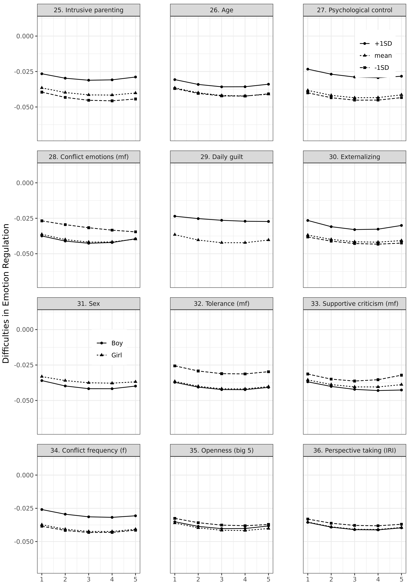

```{r setup, include=FALSE}
#css: https://maxcdn.bootstrapcdn.com/bootstrap/3.3.7/css/bootstrap.min.css
knitr::opts_chunk$set(echo = FALSE)
```

## Emotion regulation in adolescence
  
Developmentally sensitive period [@zimmermannEmotionRegulationEarly2014]

20% develop psychopathology [@leeAdolescentMentalHealth2014]

Potentially lifelong implications for mental health and well-being

```{r, out.height="20%"}
knitr::include_graphics("trajectories.jpg")
```

## Knowledge gap

Substantial empirical research, but:

* Different (sub)disciplines have approached the topic in disparate ways [@riedigerEmotionRegulationAdolescence2014]
* No consistent terminology [@bariolaChildAdolescentEmotion2011]
* No conceptual frameworks [@stifterEmotionRegulation2019]
* No overarching theoretical framework [@bussTheoriesEmotionalDevelopment2019]

Knowledge must be consolidated into overarching theory

## Relevant theory

* Bioecological model [@bronfenbrennerBioecologicalModelHuman2007]
* Transactional model [@sameroffUnifiedTheoryDevelopment2010]
* Hall's notion of "storm and stress"
* Theory of normative emotional development [@sroufeEmotionalDevelopmentOrganization1995]
* Tripartite model [@morrisRoleFamilyContext2007]
* Internalization model [@holodynskiDevelopmentEmotionsEmotion2006]
* Polyvagal theory [@porgesOrientingDefensiveWorld1995].
* Model of social-affective engagement and goal flexibility [@croneUnderstandingAdolescencePeriod2012]
* Process model of emotion regulation [@grossHandbookEmotionRegulation2013]
* Social Information Processing Theory [@lemeriseIntegratedModelEmotion2000]

## Limitations of relevant theory

* Few explicitly address adolescence
* Few comprehensively address predictors of emotion regulation
* None directly guide contemporary research 
* Theories vary widely in scope: Some are broad and non-specific; others describe a specific phenomenon in detail, but lack a broader perspective.
    + Broad theories can frame any research, specific theories generate hypotheses.
    + It would be beneficial to bridge these levels of analysis.

## Towards integrative theory

First step: identifying relevant phenomena [@borsboomTheoryConstructionMethodology2020]

We conducted a text mining systematic review (TMSR) [@vanlissaMappingPhenomenaRelevant2021]

  * Narrative reviews: small samples, confirmation bias, emphasize positive results [@littellEvidencebasedBiasedQuality2008]
  * TMSR: Unlimited sample size, transparent, objective, reproducible

6653 papers on Addresses **emotion regulation** in population overlapping with adolescence [10-24]

<doi.org/10.1007/s40894-021-00160-7>

## Co-occurrence graph

```{r networks1, eval = TRUE, results='asis', out.width = "90%"}

```

Author keywords (a) and abstracts (b)

## Next step

```{r, out.height="50%"}
knitr::include_graphics("groups.png")
```

* Predictors of latent growth model?
  + Only linear differences, few predictors (power)
* Multigroup latent growth model?
  + Non-linear differences, but only one moderator
* Latent class growth model with auxilliary variables?
  + Groups with regard to trajectory, not predictors

## Solution: Machine learning

* Allows non-linear differences between trajectories
* Performs variable selection
  + Cast wide net among potentially relevant predictors
* Checks & balances ensure generalizability
* Exploratory: No hypothesis

## Method illustrated

```{r}
knitr::include_graphics("tree.png")
```

## Method

SEM-forest [@brandmaierTheoryguidedExplorationStructural2016]

1. Bootstrap sample
2. On each sample, estimate a SEM-model
3. Consider $k$ candidate predictors
4. Identify predictor and value that maximizes $LR$ of post-split multi-group model
5. Average predictions across bootstrap samples

We used 1000 bootstrap samples, $k = 9$

<!-- TS: Confirmatory versus exploratory research: Define the distinction. -->
<!-- TS: Some longitudinal research falls between these categories. For example, complex longitudinal studies, where prior research is sufficient to lead us to hypothesize *some* associations between two constructs, but not sufficiently specific to let us hypothesize which parameters will be significant. -->

<!-- ## Results -->

<!-- * Both analyses reflected some constructs from theoretical literature -->
<!--     + neurodevelopment, socialization -->
<!-- * Undertheorized themes -->
<!--     + Developmental disorders -->
<!--     + Physical health (sic) -->
<!--     + External stressors -->
<!--     + Structural disadvantage -->
<!--     + Addictive behavior -->
<!--     + Identity and moral development -->
<!--     + Sexual development -->

<!-- * This offers guidance for phenomena to consider as relevant predictors -->


## Present study

RQ1: What are the most important predictors of adolescents' trajectories of emotion regulation development?

RQ2: What is the nature of the association of the predictors with the trajectories?

**Participants**

* RADAR data (https://www.uu.nl/en/research/radar)
* 497 Dutch adolescents (283 boys; age at T1: M =13.03, SD = 0.46)
* Collected between 2006-2011
* Most families were  medium- to high-SES (10% low-SES)

## Candidate predictors

Predictors: 87

Categories: 

* Demographics (e.g., SES)
* Biological (age, sex, pubertal development)
* Individual differences (big5, BIS/BAS, empathy)
* Risk behavior (in/externalizing symptoms, substance use, delinquency, school performance, victimization)
* Relationship quality (parents/peers)
* Parenting (perceived and parent-reported)
* Conflict resolution styles

## Dependent variable

Difficulties in emotion regulation [@gratzMultidimensionalAssessmentEmotion2004]

* 24 items (omitted 'emotional awareness' subscale)
* E.g.: “When I’m upset, I have difficulty thinking about anything else”
* 1 (“Almost never”) to 5 (“Almost always”)
* Excellent reliability, $(.94 > \alpha > .95)$.
* Metric invariance across waves
* Quadratic growth model had good fit
  + CFI = .996, TLI = .993, RMSEA = .047, SRMR = 0.020

## Open science

Workflow for Open Reproducible Code in Science (WORCS) used to make analyses reproducible [@vanlissaWORCSWorkflowOpen2020]

All code and synthetic data available at

<https://github.com/cjvanlissa/veni_forest>

# Results

## Variable importance

```{r, out.height="100%"}
vim <- readRDS("varimp_comb_21-08-2021.RData")
vim
```

## Marginal association

```{r, out.width="40%"}
knitr::include_graphics("plots/pdp1-12.png")
```

## Marginal association 2

```{r, out.width="40%"}

```

## Marginal association 3

```{r, out.width="40%"}

```

## Marginal association 4

```{r, out.width="40%"}

```

## Summary

Important:

* Best predictors: Personality and related constructs
* Best parental predictor is autonomy support (bal. rel.)
  + Negative/intrusive parenting more predictive than other positive practices
* Conflict frequency and behavior
* Empathy, particularly personal distress

Less important than expected:

* SES
* Bullying/victimization
* Delinquency
* Substance use
* Monitoring

## Reflection content

* Most important predictors are routinely assessed (big 5) or overt (conflict)
  + Prime candidates for early risk assessment
  + Conflict resolution behavior can be taught
    - Target for intervention if association is causal
* Emphasis on parenting (in literature and theory) might not be justified
  + Congruent with RI-CLPM showing few parenting effects in adolescence [@vanlissaRoleFathersMothers2019]
* Order of predictors mirrors bioecological model

## {.fullslide}


## Reflections form

* Many predictors show non-linear effects: Emotion dysregulation only for +/-1SD
* Some predictors show almost no marginal effect (e.g., father's age, drug use)
  + This suggests they might be important in **interactions**

## Limitations

* Selective sample
  + WEIRD, Dutch, mostly mid- high-SES (restriction of range)
* Panel study, so few biological / cognitive / neurological measures
* Relatively small sample size
  + If you have access to 1000+ sample, please get in touch
* Computational constraints prevented us from tuning the model beyond default settings, and from exploring marginal effects for higher order interactions

## Conclusions

* Proximal factors more predictive of ER development than distal predictors
* Parenting may be less relevant than previously thought
* Personality and conflict behavior are candidates for early diagnosis
* Conflict skills training might be avenue for intervention

## References