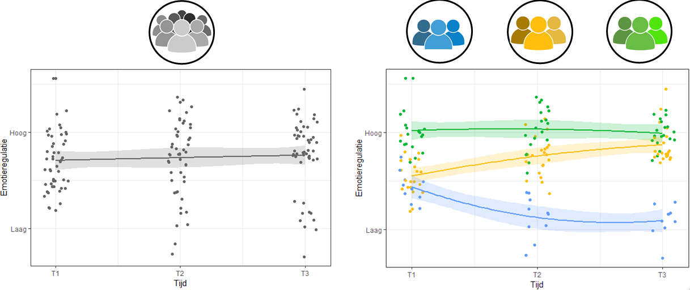
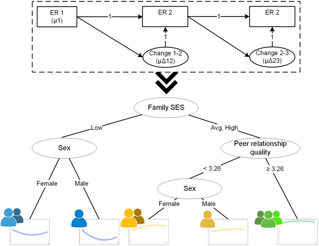

```{r setup, include=FALSE}
#css: https://maxcdn.bootstrapcdn.com/bootstrap/3.3.7/css/bootstrap.min.css
knitr::opts_chunk$set(echo = FALSE, message = FALSE, warning = FALSE)
```

# Conceptual introduction

## Central thesis

_Machine learning_ can help advance _theory formation_ in developmental psychology

* Replication crisis [@scheelWhyMostPsychological2022; @lavelleWhenCrisisBecomes2021]
* Solutions improve deductive (theory-testing) research practices
    + questionable research practices (QRPs)
    + replication
    + preregistration

Many preregistered hypotheses are not supported [@scheelExcessPositiveResults2021]

* Lack of "good theories" another explanation for replication crisis

## Defining theory

**Theory**: A model that describes the nature of relations between several phenomena in sufficient detail that it allows for the derivation of quantifiable hypotheses that can be subject to (severe) testing.

* most psychological theories fall short of this definition
    + insufficiently precise
    + too flexible
* Compare to @walasekEvolutionaryModelSensitive2022

Why do we need theory?

* Useful as an instrument of cumulative knowledge acquisition
* Communicating social scientific research to its consumers

## Deduction vs induction

```{r, out.width="60%"}
library(tidySEM)
lay <- get_layout("the1", "the2",
                  "hyp1", "hyp2",
                  "pat1", "obs2",
                  "obs1", "con2", rows = 4)
nodes <- data.frame(
  name = as.vector(lay),
  label = c("Theory", "Working hypothesis", "Pattern", "Observation", "Theory", "Hypothesis", "Observation", "Test"),
  shape = rep("rect", length(lay)),
  group = rep(c("Inductive", "Deductive"), each = 4)
  )
edges <- data.frame(
  from = c("the1", "hyp1", "pat1", "the2", "hyp2", "obs2"),
  to = c("hyp1", "pat1", "obs1", "hyp2", "obs2", "con2"),
  arrow = rep(c("first", "last"), each = 3),
  group = rep(c("Inductive", "Deductive"), each = 3)
)
g <- prepare_graph(edges = edges, layout = lay, nodes = nodes)
plot(g)
```

* Lack of theory cannot be overcome by improving deductive research
* Theory formation requires inductive (exploratory) research [@creswellDesigningConductingMixed2017]

## Empirical cycle 


```{r, out.width="60%"}
library(tidySEM)
lay <- get_layout("",     "the1", "", 
                  "pat1", "",     "hyp1",
                  "",     "obs1", "",
                  "",     "tes",  "", rows = 4)
nodes <- data.frame(
  name = c("pat1", "the1", "obs1", "tes", "hyp1"),
  label = c("Patterns", "Theory", "Observation", "Test", "Hypothesis"),
  shape = "rect")
edges <- data.frame(
  from = c("the1", "hyp1", "obs1", "pat1", "obs1"),
  to = c("hyp1", "obs1", "pat1", "the1", "tes"),
  arrow = "last"
)
g <- prepare_graph(edges = edges, layout = lay, nodes = nodes, angle = 5)
g$edges$connect_from <- c("right", "bottom", "left", "top", "bottom")
g$edges$connect_to <- c("top", "right", "bottom", "left", "top")


plot(g)
```

De Groot’s empirical cycle: a model of knowledge production through scientific research [@degrootMethodologieGrondslagenVan1961]

## Rigorous exploration

How can we improve exploratory research?

Role of flexibility: 

* Confirmatory methods poorly suited to exploratory research
    + p-values: Type I error is 5%, but false discovery rate (FDR) is 14-50% [@vidgenPValuesMisunderstoodMisused2016].
    + Model fit indices: manually specify models, no guarantee that best model is included
    
"unguided exploration" is effortful and inflates the risk of spurious results

## Machine learning

**Machine learning**:

* automated model building
* checks and balances to prevent overfitting
* maximize predictive performance and generalizability of results

Psychology can benefit from its superior predictive performance [@yarkoniChoosingPredictionExplanation2017]

**NEW**: Implications for the theory crisis have not yet been discussed

## Machine learning vs unguided exploration

```{r}

```


## Phenomena detection  

First step in *Theory Construction Methods* is identifying relevant phenomena [@borsboomTheoryConstructionMethodology2020]

* Phenomena: stable and general features of the world
* Few quantitative methods for phenomena detection (aside from expert opinion)

**Text mining** may be suitable for phenomena detection [@vanlissaMappingPhenomenaRelevant2021]

* Unsupervised learning method
* Clusters in keywords and abstracts

## Holistic approach

Every study examines only a piece of the puzzle; we never see the complete picture

Machine learning accommodates more predictors than classical methods

* Regularization 
* Variable selection

Including all relevant predictors is important:

* Assumption for causal interpretation
    + Multicollinearity
* Good theory incorporates most important causes
    + Cannot assess the relative utility across studies
* Include potential predictors from various theories, and undertheorized factors

## Complex effects

Many machine learning methods accommodate:

* non-linear effects 
* higher-order interactions, without having to specify the nature of these effects a-priori.
* Automatic: tree-based methods
* Manual: penalized methods

Psychological theories rarely account for complex effects

* Machine learning can provide nuance by revealing them

## Theoretical elements

Some machine learning methods incorporate theoretical elements

* E.g.: assumption that development follows a latent growth curve (LGC).
* SEM forests [@brandmaierTheoryguidedExplorationStructural2016]
* regularized SEM [@jacobucciRegularizedStructuralEquation2016]

When the theory is a (nomological) network:

* LASSO-penalized Gaussian graphical model (GGM) [@epskampGeneralizedNetworkPsychometrics2017]
* E.g.: network theory of major depression [@cramerMajorDepressionComplex2016]

All of these methods allow for theory guided exploration using machine learning

## Person-centered approaches

Explain heterogeneity at a more fine-grained level than the whole sample

* E.g., latent class analyses
    + "Which individuals are similar?"
    + Other *unsupervised learning* methods exist
* RI-CLPM and DSEM
    + Rarely explain heterogeneity in within-person effects
    + Regularization
* Tree-based models
    + Group individuals based on predictors to maximize homogeneity of the outcome
    + "Why are these individuals similar?"

## Generalizability

When using data models to guide theory formation, generalizability is essential

Checks and balances to curtail *overfitting*

* cross-validation to estimate predictive accuracy

<!-- Any model captures both *signal* and *noise* -->

<!-- **Overfitting**: model captures so much noise that it generalizes poorly to new samples -->

```{r, out.width="40%"}
library(ggplot2)
colors <- c("Variance" = "red", "Bias" = "green", "Total error" = "black")

ggplot() +
  xlim(-3, 3) +
geom_function(
  data = NULL,
  stat = "function",
  position = "identity",
  fun = ~.x^2,
  na.rm = FALSE,
  inherit.aes = TRUE,
  size = 1,
  aes(colour = "Total error")
) +
  geom_function(
    data = NULL,
    stat = "function",
    position = "identity",
    fun = ~2^.x -2,
    na.rm = FALSE,
    inherit.aes = TRUE,
    aes(colour = "Bias"),
    size = 1
  )+
  geom_function(
    data = NULL,
    stat = "function",
    position = "identity",
    fun = ~2^-.x -2,
    na.rm = FALSE,
    inherit.aes = TRUE,
    aes(colour = "Variance"),
    size = 1
  ) +
  labs(x = "Model complexity",
       y = "Optimal model complexity",
       color = "Legend") +
  scale_color_manual(values = colors) +
  geom_vline(xintercept = 0, linetype = 2) +
  theme_bw() +
  theme(axis.text = element_blank(), axis.ticks = element_blank())
```


## From models to theory

Naive interpretative approach

* Variable importance metrics
    + congruent with theoretical assumptions about important predictors?
    + any theoretically important predictors rank low?
    + any undertheorized factors rank high?
    
* Marginal associations
    + non-linear effects?
    + high importance but flat marginal association?

Comparing predictive performance of simpler parametric model that represents these 'insights' to machine learning model

## From models to theory 2

Data models -> formal theory [@haslbeckModelingPsychopathologyData2021]

* abductive formal theory construction (AFTC) framework
    + construct formal theory, generate data, mathematically compare to empirical data
    + Discrepancies: amend formal theory

## Summary

* There is a paucity of good theory
* Need for exploratory research for theory formation
* Machine learning for rigorous exploration
    + automates model building
    + incorporates checks and balances for generalizable results
* Unsupervised learning can assist in phenomenon detection
* Supervised learning to identify important predictors
* Some algorithms incorporate basic theoretical elements

# Applied examples

## Emotion regulation in adolescence
  
Developmentally sensitive period [@zimmermannEmotionRegulationEarly2014]

20% develop psychopathology [@leeAdolescentMentalHealth2014]

Potentially lifelong implications for mental health and well-being

```{r, out.height="20%"}

```

## Knowledge gap

Substantial empirical research, but:

* Different (sub)disciplines have approached the topic in disparate ways [@riedigerEmotionRegulationAdolescence2014]
* No consistent terminology [@bariolaChildAdolescentEmotion2011]
* No conceptual frameworks [@stifterEmotionRegulation2019]
* No overarching theoretical framework [@bussTheoriesEmotionalDevelopment2019]

Knowledge must be consolidated into overarching theory

## Limitations of relevant theory

* Few explicitly address adolescence
* Few comprehensively address predictors of emotion regulation
* None directly guide contemporary research 
* Theories vary widely in scope: Some are broad and non-specific; others describe a specific phenomenon in detail, but lack a broader perspective.
    + Broad theories can frame any research, specific theories generate hypotheses.
    + It would be beneficial to bridge these levels of analysis.

## Towards integrative theory

First step: identifying relevant phenomena [@borsboomTheoryConstructionMethodology2020]

We conducted a text mining systematic review (TMSR) [@vanlissaMappingPhenomenaRelevant2021]

  * Narrative reviews: small samples, confirmation bias, emphasize positive results [@littellEvidencebasedBiasedQuality2008]
  * TMSR: Unlimited sample size, transparent, objective, reproducible

6653 papers on Addresses **emotion regulation** in population overlapping with adolescence [10-24]

<doi.org/10.1007/s40894-021-00160-7>

## Open science

All code and data available at <https://github.com/cjvanlissa/veni_sysrev>

Workflow for Open Reproducible Code in Science (WORCS) used to make analyses reproducible [@vanlissaWORCSWorkflowOpen2020]

## Baseline

Manual selection of key constructs from relevant theory and prior reviews [ @bariolaChildAdolescentEmotion2011; @coe-odessEmergentEmotionsAdolescence2019]:

* Bioecological model [@bronfenbrennerBioecologicalModelHuman2007]
* Transactional model [@sameroffUnifiedTheoryDevelopment2010]
* Hall's notion of "storm and stress"
* Theory of normative emotional development [@sroufeEmotionalDevelopmentOrganization1995]
* Tripartite model [@morrisRoleFamilyContext2007]
* Internalization model [@holodynskiDevelopmentEmotionsEmotion2006]
* Polyvagal theory [@porgesOrientingDefensiveWorld1995].
* Model of social-affective engagement and goal flexibility [@croneUnderstandingAdolescencePeriod2012]
* Process model of emotion regulation [@grossHandbookEmotionRegulation2013]
* Social Information Processing Theory [@lemeriseIntegratedModelEmotion2000]


## Baseline network

```{r figbaseline, warning=FALSE, eval = TRUE, results='asis', out.width = "90%", fig.cap="Phenomena relevant to adolescents' emotion regulation according to theory (a) and narrative reviews (b; transparent nodes indicate constructs also present in the theory)."}
knitr::include_graphics("../veni_sysrev/baseline_network.png") 
```

(a) Theory (b) narrative reviews; transparent nodes indicate constructs also present in theory.

## {.fullslide}


## Co-occurrence graph

```{r networks1, eval = TRUE, results='asis', out.width = "90%"}
knitr::include_graphics("../veni_sysrev/tmnetworks_small.png")
```

Author keywords (a) and abstracts (b)

## Results

* Both analyses reflected some constructs from theoretical literature
    + Particularly related to neurodevelopment and socialization
* Mental health-related outcomes feature prominently
    + Emotion regulation implicated in mental health problems [@leeAdolescentMentalHealth2014],
    + This underlines the importance of research in this area
* Substantial correspondence between keywords and abstracts, suggesting validity of method
* Networks are sparse; few connections among constructs: fragmented literature

## Undertheorized themes

* Developmental disorders
* Physical health (sic)
* External stressors
* Structural disadvantage
* Addictive behavior
* Identity and moral development
* Sexual development

## Implications

* Empirical research relies on theory; under-theorized phenomena may be overlooked
    + This study offers guidance for phenomena to consider as confounders/causes
* Unembedded terms indicate promising areas of future research
* Present study serves as starting point for theory development

## Next step

```{r, out.height="50%"}

```

* Predictors of latent growth model?
  + Only linear differences, few predictors (power)
* Multigroup latent growth model?
  + Non-linear differences, but only one moderator
* Latent class growth model with auxilliary variables?
  + Groups with regard to trajectory, not predictors

## Solution: Machine learning

* Allows non-linear differences between trajectories
* Performs variable selection
  + Cast wide net among potentially relevant predictors
* Checks & balances ensure generalizability
* Exploratory: No hypothesis

## Method illustrated

```{r}

```

## Method

SEM-forest [@brandmaierTheoryguidedExplorationStructural2016]

1. Bootstrap sample
2. On each sample, estimate a SEM-model
3. Consider $k$ candidate predictors
4. Identify predictor and value that maximizes $LR$ of post-split multi-group model
5. Average predictions across bootstrap samples

We used 1000 bootstrap samples, $k = 9$

<!-- TS: Confirmatory versus exploratory research: Define the distinction. -->
<!-- TS: Some longitudinal research falls between these categories. For example, complex longitudinal studies, where prior research is sufficient to lead us to hypothesize *some* associations between two constructs, but not sufficiently specific to let us hypothesize which parameters will be significant. -->

<!-- ## Results -->

<!-- * Both analyses reflected some constructs from theoretical literature -->
<!--     + neurodevelopment, socialization -->
<!-- * Undertheorized themes -->
<!--     + Developmental disorders -->
<!--     + Physical health (sic) -->
<!--     + External stressors -->
<!--     + Structural disadvantage -->
<!--     + Addictive behavior -->
<!--     + Identity and moral development -->
<!--     + Sexual development -->

<!-- * This offers guidance for phenomena to consider as relevant predictors -->


## Present study

RQ1: What are the most important predictors of adolescents' trajectories of emotion regulation development?

RQ2: What is the nature of the association of the predictors with the trajectories?

**Participants**

* RADAR data (https://www.uu.nl/en/research/radar)
* 497 Dutch adolescents (283 boys; age at T1: M =13.03, SD = 0.46)
* Collected between 2006-2011
* Most families were  medium- to high-SES (10% low-SES)

## Candidate predictors

Predictors: 87

Categories: 

* Demographics (e.g., SES)
* Biological (age, sex, pubertal development)
* Individual differences (big5, BIS/BAS, empathy)
* Risk behavior (in/externalizing symptoms, substance use, delinquency, school performance, victimization)
* Relationship quality (parents/peers)
* Parenting (perceived and parent-reported)
* Conflict resolution styles

## Dependent variable

Difficulties in emotion regulation [@gratzMultidimensionalAssessmentEmotion2004]

* 24 items (omitted 'emotional awareness' subscale)
* E.g.: “When I’m upset, I have difficulty thinking about anything else”
* 1 (“Almost never”) to 5 (“Almost always”)
* Excellent reliability, $(.94 > \alpha > .95)$.
* Metric invariance across waves
* Quadratic growth model had good fit
  + CFI = .996, TLI = .993, RMSEA = .047, SRMR = 0.020

## Open science

Workflow for Open Reproducible Code in Science (WORCS) used to make analyses reproducible [@vanlissaWORCSWorkflowOpen2020]

All code and synthetic data available at

<https://github.com/cjvanlissa/veni_forest>

# Results

## Variable importance

```{r, out.height="100%"}
vim <- readRDS("varimp_comb_21-08-2021.RData")
vim
```

## Marginal association

```{r, out.width="40%"}

```


## Summary

Important:

* Best predictors: Personality and related constructs
* Best parental predictor is autonomy support (bal. rel.)
  + Negative/intrusive parenting more predictive than other positive practices
* Conflict frequency and behavior
* Empathy, particularly personal distress

Less important than expected:

* SES
* Bullying/victimization
* Delinquency
* Substance use
* Monitoring

## Reflection content

* Most important predictors are routinely assessed (big 5) or overt (conflict)
  + Prime candidates for early risk assessment
  + Conflict resolution behavior can be taught
    - Target for intervention if association is causal
* Emphasis on parenting (in literature and theory) might not be justified
  + Congruent with RI-CLPM showing few parenting effects in adolescence [@vanlissaRoleFathersMothers2019]
* Order of predictors mirrors bioecological model


## Reflections form

* Many predictors show non-linear effects: Emotion dysregulation only for +/-1SD
* Some predictors show almost no marginal effect (e.g., father's age, drug use)
  + This suggests they might be important in **interactions**

## Conclusions

* Proximal factors more predictive of ER development than distal predictors
* Parenting may be less relevant than previously thought
* Personality and conflict behavior are candidates for early diagnosis
* Conflict skills training might be avenue for intervention

## References